# 有人304获取正泰电表数据并上传有人云

## 基础准备

1. 有人串口服务器 304
2. 通讯线
3. 正泰电表带 `Modbus` 通讯协议，并设置为 `Modbus` 通讯协议

## 安全提醒

!!! warning "安全提醒"
    本文涉及 220V 交流电操作，接线错误可能导致设备损坏、火灾甚至触电伤亡。

    若您不具备专业电工知识与操作资质，请勿自行操作，务必委托持证电工完成接线。
    
    作者仅提供技术参考，不承担任何因操作不当引发的安全责任。

## 通讯接线示例

## 操作过程

### 有人设备上电并连接电脑

> `有人串口服务器 304` 设备上电并使用网线接入电脑

### 访问有人设备

> 访问 `http://192.168.0.7`，账号密码均为 `admin`

### 切换中文语言

> 点击右上角 `中文` 切换中文语言

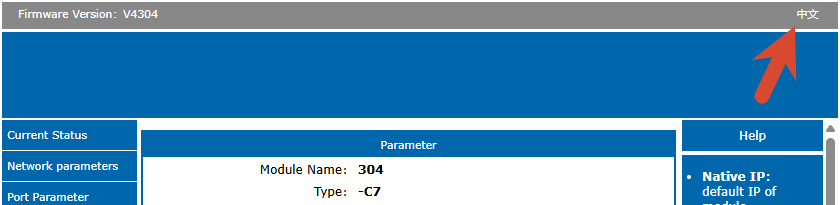

### DHCP获取IP

> `网络参数` -> `IP获取方式` -> 调整为 `DHCP` -> `保存` -> `重启模块`

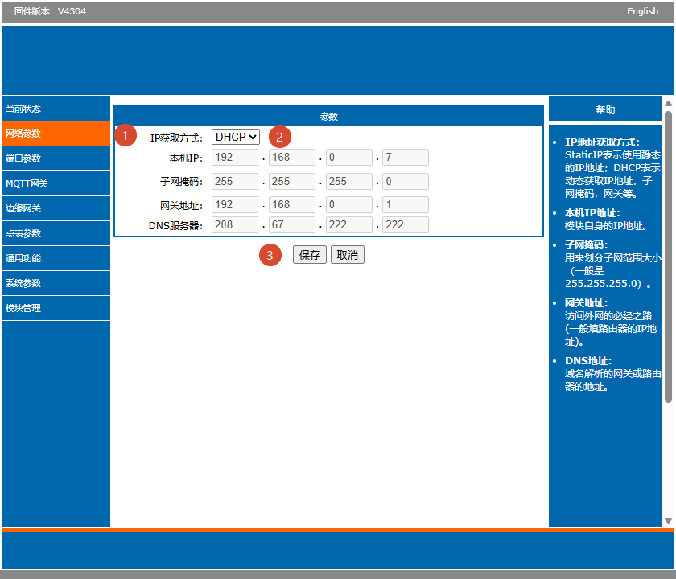

> 接入网络，找到设备IP并访问设备管理后台

### 登录有人云

> 登录有人云

### 添加有人云组织

> 添加组织

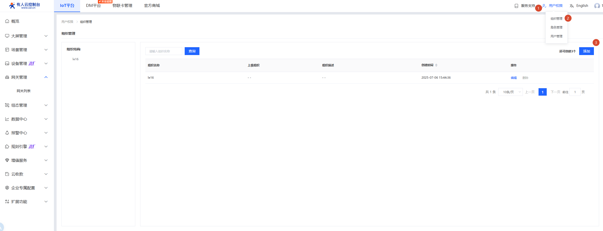

### 添加有人云网关

> 添加网关

> 填写 `网关名称`、`所属组织`，点击 `SN不支持，点击这里`

> 点击保存

### 设置端口参数

> 打开 `端口参数`，配置如下

- 波特率：`9600`
- 【默认】数据位：8
- 【默认】校验位：NONE
- 【默认】停止位：1
- 【默认】本地端口：0
- 远程端口：`网关中端口号`
- 【默认】工作方式：TCP Client
- 远程服务器地址：`网关中云平台接入地址`
- 【默认】短连接使能：Close
- 【默认】短连接超时：3

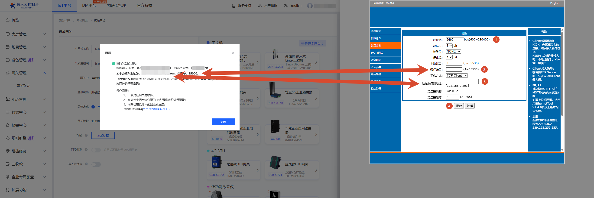

### 设置通用功能

> 打开 `通用功能`，配置如下

- 【默认】心跳包使能：心跳包关闭
- 注册包使能：`有人云`
- 有人云ID：`网关中网关SN`
- 有人云密码：`网关中通讯密码`
- 【默认】Reset：无勾选
- 【默认】Link：无勾选
- 【默认】Index：无勾选
- 【默认】类RFC2217：勾选
- 【默认】清除缓存数据：无勾选

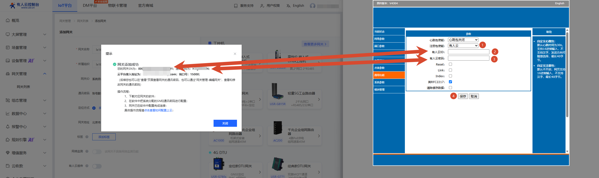

> `保存` -> `重启模块`

### 有人设备上线

> 等待设备上线

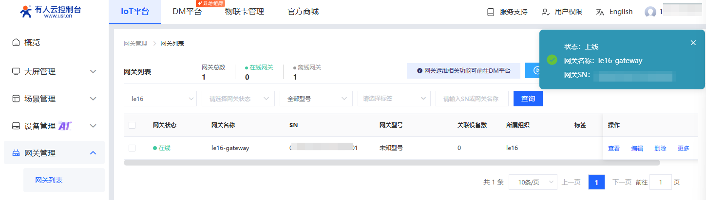

### 有人云添加设备

> 添加设备

> 填写 `设备名称`、`所属组织`、`关联网关`

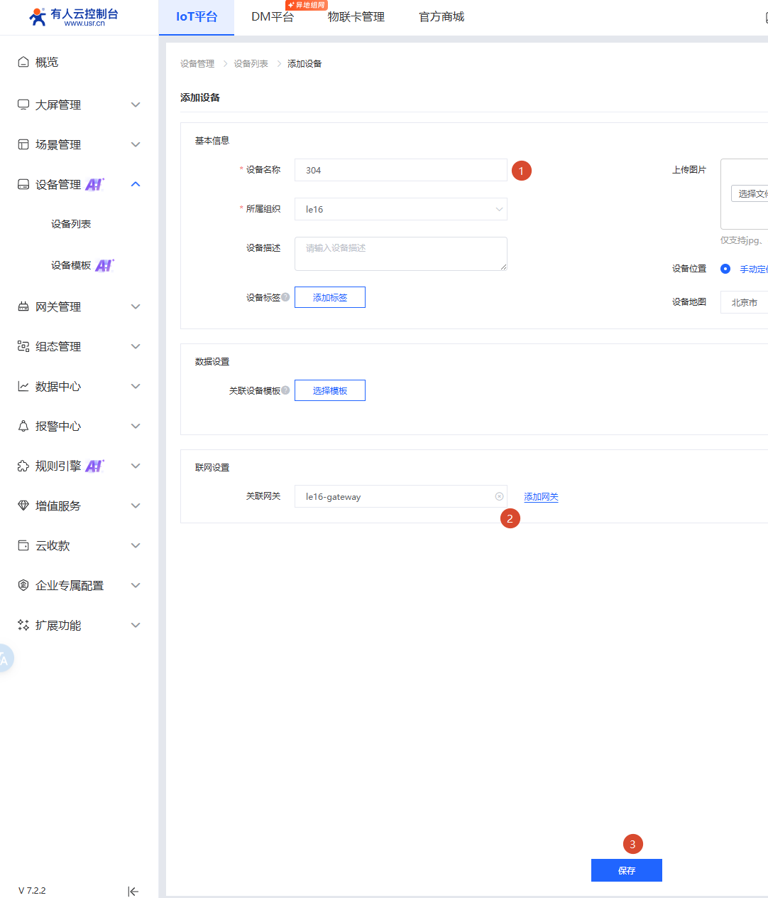

### 有人云添加设备模板

> 添加 `设备模板`

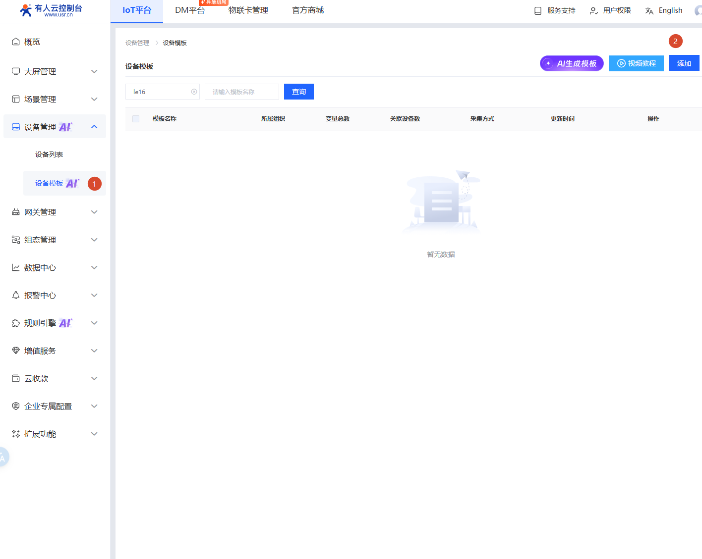

> 填写 `模板名称`、点击添加变量

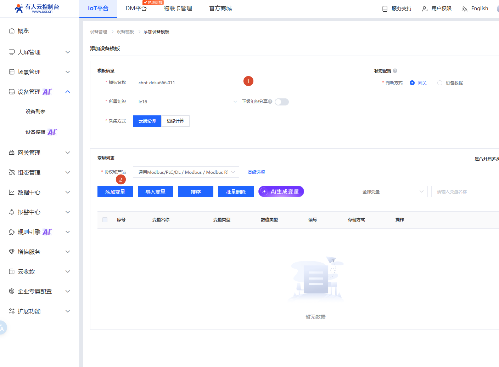

> 添加变量，配置如下：

- 变量名称：`A相电压`
- 变量单位：`V`
- 变量类型：`直采变量`
- 寄存器：`3`
- 寄存器编号：`8193`
- 数据格式：`32位 浮点数（AB CD）`
- 采集频率：`5分钟`
- 数字格式：`保留1位小数`、勾选 `小数位补齐`
- 存储方式：勾选 `全部存储`
- 读取方式：选择 `只读`

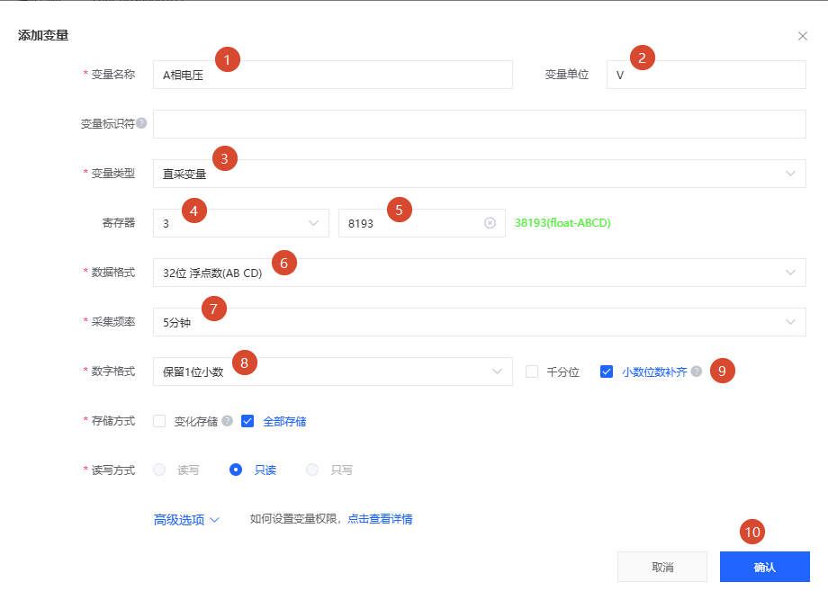

### 有人云设备关联设备模板

> 将 `设备` 关联 `设备模板`

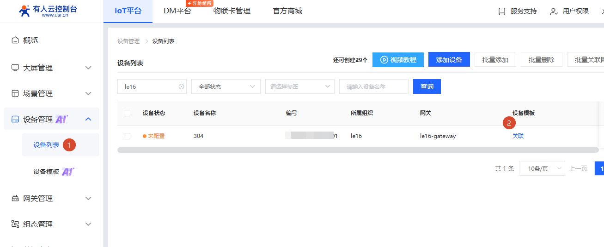

> 选择 `关联设备模板`，串口序号：`1`，从机地址：`1`

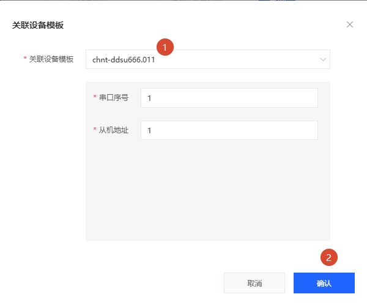

### 有人云设备查看

> 查看设备

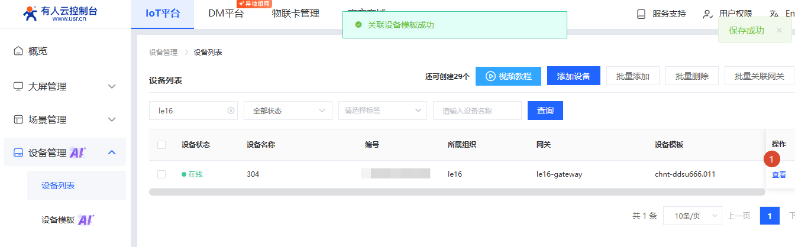

### 有人云设备主动采集

> 点击 `主动采集`

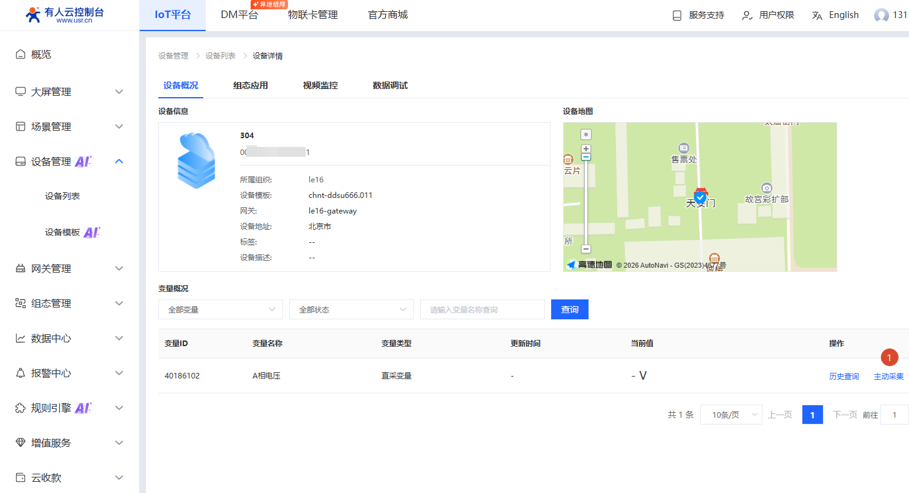

> 采集数据，如下图

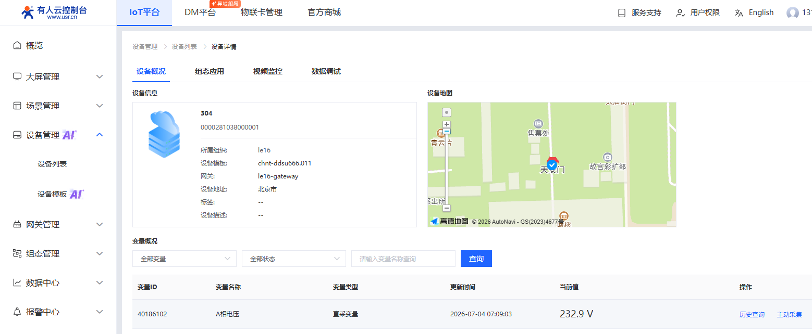

### 补全其他采集数据

> 将 `二次侧电量数据` 以及 `电能二次侧数据` 添加

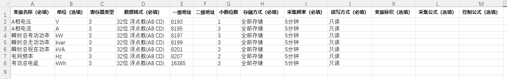

### 最终效果

> 最终效果，如下图

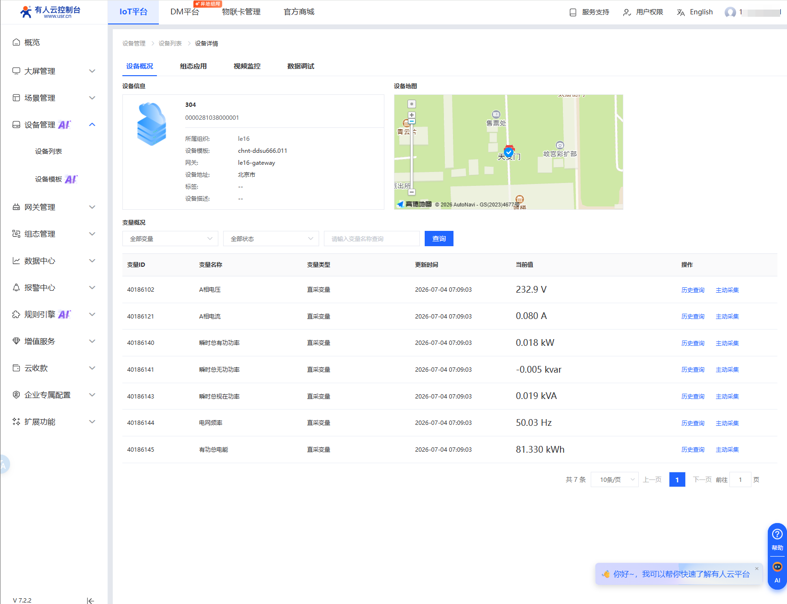

!!! info "参考文档"
    1. [【说明书】USR-TCP232-30X系列说明书V3.0.2.pdf](https://www.usr.cn/wiki/puba/Br6DMHFlk){target=blank}
    2. [正泰单相 DDSU666](https://www.solarahorizon.cn/helpcenter/electric-meter/ddsu666.html){target=blank}
    3. [DDSU666 单相电子式电能表（导轨） 使用说明书 ZTW0.464.0090](https://aiot.chint.com/upload/img/2024-03/6604b8f947f2c.pdf){target=blank}