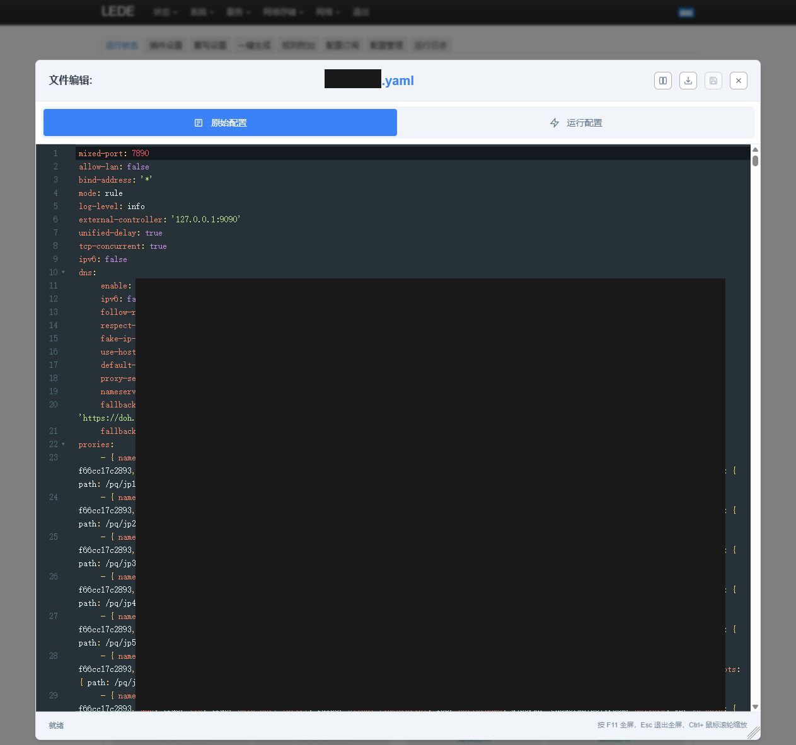
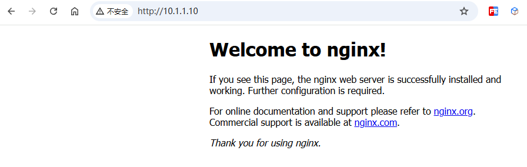
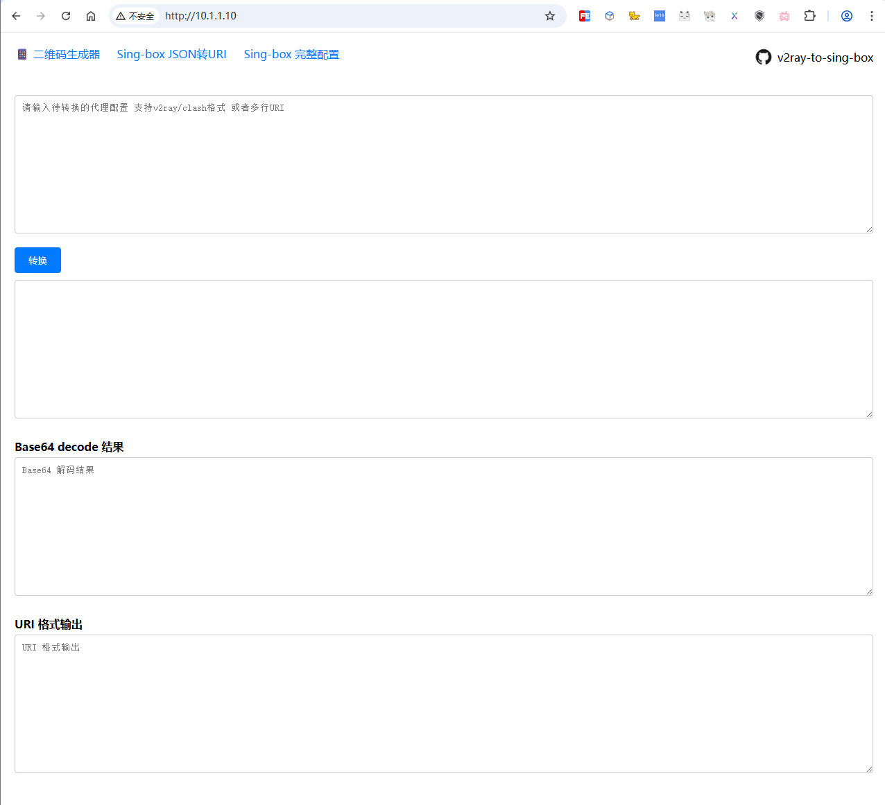
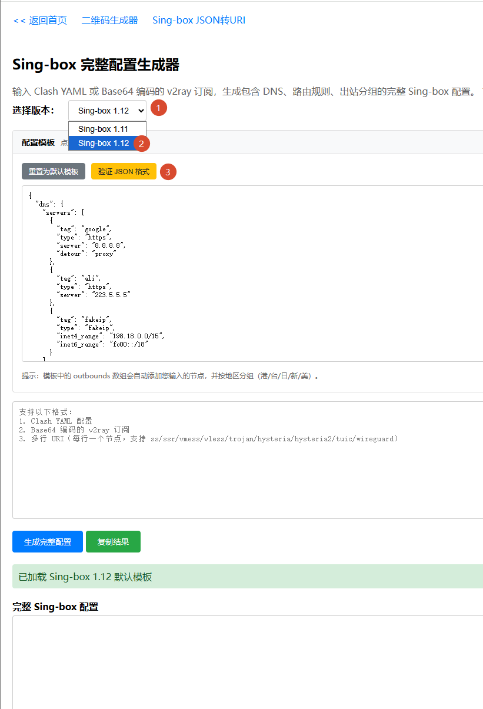
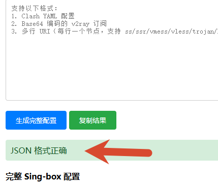
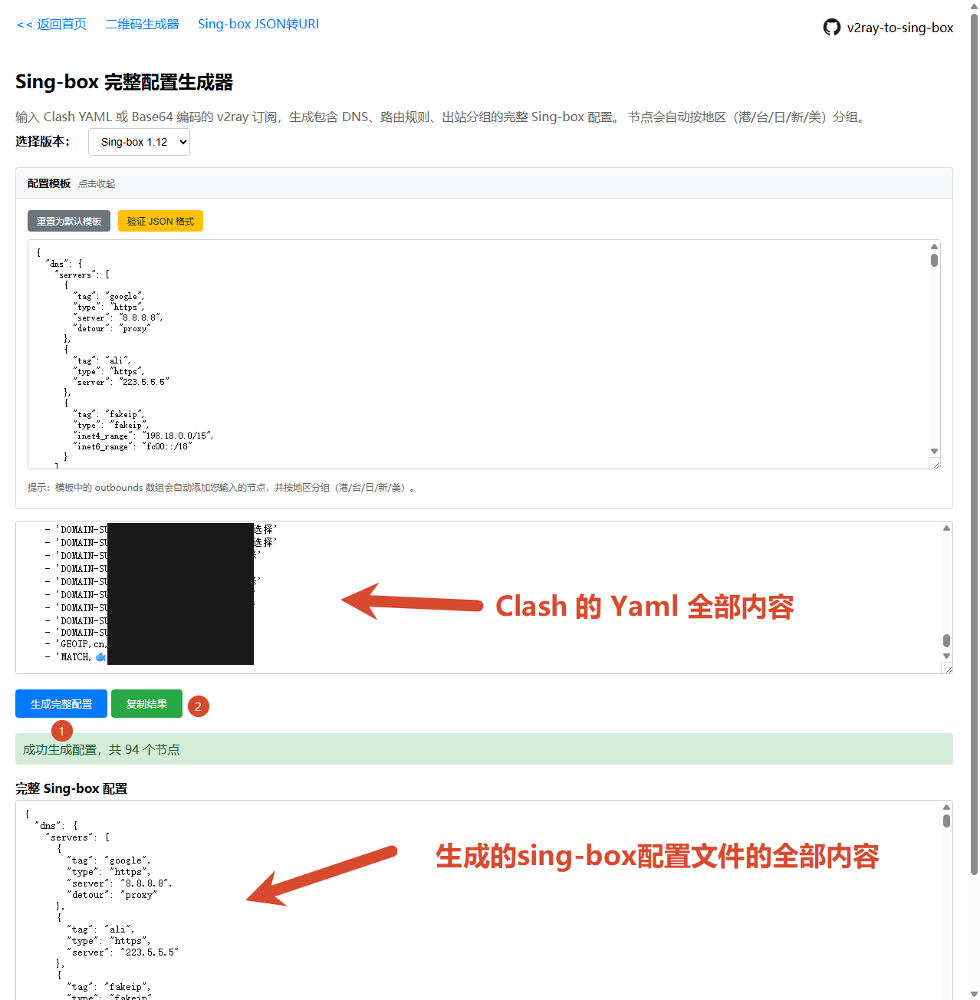

# 【VMware Workstation】Debian 13 安装 sing-box（Clash配置转换sing-box配置）

## 前置工作

1. debian 13 虚拟机系统
2. Debian 虚拟机需要连接到外网
3. Clash 的 yaml 文件
4. 操作用户需要有 sudo 权限
5. 配置系统软件源

## 前置工作 - debian 13 虚拟机系统

操作略

## 前置工作 - Debian 虚拟机需要连接到外网

操作略

## 前置工作 - Clash 的 yaml 文件

如下图所示：



## 前置工作 - 操作用户需要有 sudo 权限

```shell
# 切换 root
su - root
# 添加到 sudo 组
usermod -aG sudo porschan
# 切换为用户
su - porschan
```

## 前置工作 - 配置系统软件源

备份当前配置

```shell
sudo mv /etc/apt/sources.list /etc/apt/bak.sources.list.20260430
```

创建 `sources.list` 文件

```shell
sudo nano /etc/apt/sources.list
```

内容如下：

```list
# 原 CD-ROM 源（已禁用，如需使用请取消注释）
# deb cdrom:[Debian GNU/Linux 13.1.0 _Trixie_ - Official amd64 DVD Binary-1 with firmware 20250906-10:24]/ trixie contrib main non-free-firmware

# 阿里云镜像主仓库（Debian 12 bookworm）
deb http://mirrors.aliyun.com/debian/ bookworm main non-free-firmware non-free contrib
# 主仓库源代码
deb-src http://mirrors.aliyun.com/debian/ bookworm main non-free-firmware non-free contrib

# 安全更新仓库
deb http://mirrors.aliyun.com/debian-security/ bookworm-security main non-free-firmware non-free contrib
# 安全更新源代码
deb-src http://mirrors.aliyun.com/debian-security/ bookworm-security main non-free-firmware non-free contrib

# 常规更新仓库
deb http://mirrors.aliyun.com/debian/ bookworm-updates main non-free-firmware non-free contrib
# 常规更新源代码
deb-src http://mirrors.aliyun.com/debian/ bookworm-updates main non-free-firmware non-free contrib
```

更新软件包索引

```shell
sudo apt update
```

## 准备 `sing-box` 工作目录，并加入工作目录

```shell
mkdir -p /home/porschan/lab/01-sing-box
cd /home/porschan/lab/01-sing-box
```

## 下载 sing-box 安装包，并指定下载目录

```txt
sudo wget -P /home/porschan/lab/01-sing-box https://github.com/SagerNet/sing-box/releases/download/v1.13.11/sing-box_1.13.11_linux_amd64.deb
```

## 安装 sing-box

```shell
sudo apt install /home/porschan/lab/01-sing-box/sing-box_1.13.11_linux_amd64.deb
```

## 检查是否安装成功

```shell
porschan@OpenWrt-Lab:~/lab/01-sing-box$ sudo sing-box 
Usage:
  sing-box [command]

Available Commands:
  check       Check configuration
  completion  Generate the autocompletion script for the specified shell
  format      Format configuration
  generate    Generate things
  geoip       GeoIP tools
  geosite     Geosite tools
  help        Help about any command
  merge       Merge configurations
  rule-set    Manage rule-sets
  run         Run service
  tools       Experimental tools
  version     Print current version of sing-box

Flags:
  -c, --config stringArray             set configuration file path
  -C, --config-directory stringArray   set configuration directory path
  -D, --directory string               set working directory
      --disable-color                  disable color output
  -h, --help                           help for sing-box

Use "sing-box [command] --help" for more information about a command.
```

## 创建 systemd 服务文件

```shell
sudo nano /etc/systemd/system/sing-box.service
```

内容如下

```shell
[Unit]
Description=sing-box universal proxy platform
After=network.target nss-lookup.target

[Service]
User=root
CapabilityBoundingSet=CAP_NET_ADMIN CAP_NET_BIND_SERVICE
AmbientCapabilities=CAP_NET_ADMIN CAP_NET_BIND_SERVICE
NoNewPrivileges=true
ExecStart=/usr/bin/sing-box run -c /etc/sing-box/config.json
Restart=on-failure
RestartSec=3s

[Install]
WantedBy=multi-user.target
```

## 安装 Nginx

```shell
sudo apt install -y nginx
```

## 检查是否安装成功

在浏览器输入 `http://10.1.1.10`，如下图所示



## 删除 nginx 默认网站目录

```shell
sudo rm -rf /var/www/html/*
```

## 下载 转换sing-box配置的页面

```shell
# 安装 git
sudo apt install -y git
# 下载 转换sing-box配置的页面
sudo git clone https://github.com/wynemo/v2ray-to-sing-box /var/www/html
```

## 访问 转换sing-box配置的页面

在浏览器输入 `http://10.1.1.10`，如下图所示



点击 Sing-box 完整配置


选择版本： `Sing-box 1.12`
点击：`验证 JSON 格式`



验证 JSON 格式成功如下图所示



将 Clash 的 Yaml 文件全部内容生成 sing-box 配置文件全部内容，如下图所示



## 将转换后的 sing-box 配置文件配置到 config.json

```shell
sudo nano /etc/sing-box/config.json
```

全部内容为 `生成的 sing-box 配置文件的全部内容`

## 检查 sing-box 配置

```shell
sudo sing-box -c /etc/sing-box/config.json check
```

## 启动 sing-box 服务，并开机自启该服务

```shell
sudo systemctl enable --now sing-box
```

另外常用的命令行

```shell
操作	命令
启动服务	sudo systemctl start sing-box
停止服务	sudo systemctl stop sing-box
重启服务	sudo systemctl restart sing-box
查看运行状态	sudo systemctl status sing-box
查看实时日志	sudo journalctl -u sing-box --output cat -f
查看完整日志	sudo journalctl -u sing-box --output cat -e
禁用开机自启	sudo systemctl disable sing-box
重新加载配置（需要服务支持热重载，若不支持则需重启）	sudo systemctl reload sing-box
```

## 虚拟机内使用浏览器访问一些网站，如下图所示


## 虚拟机拍摄快照

操作略

!!! info "参考链接"
    1. [手机端生成 Sing-box 配置教程](https://www.bilibili.com/video/BV1jhrLBkE43){target=blank}
    2. [sing-box 官方文档](https://sing-box.sagernet.org/zh/){target=blank}