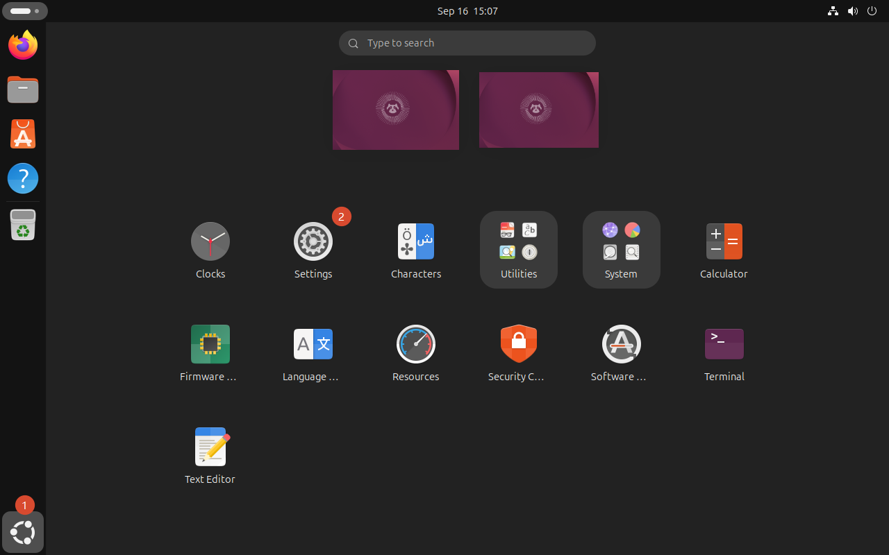
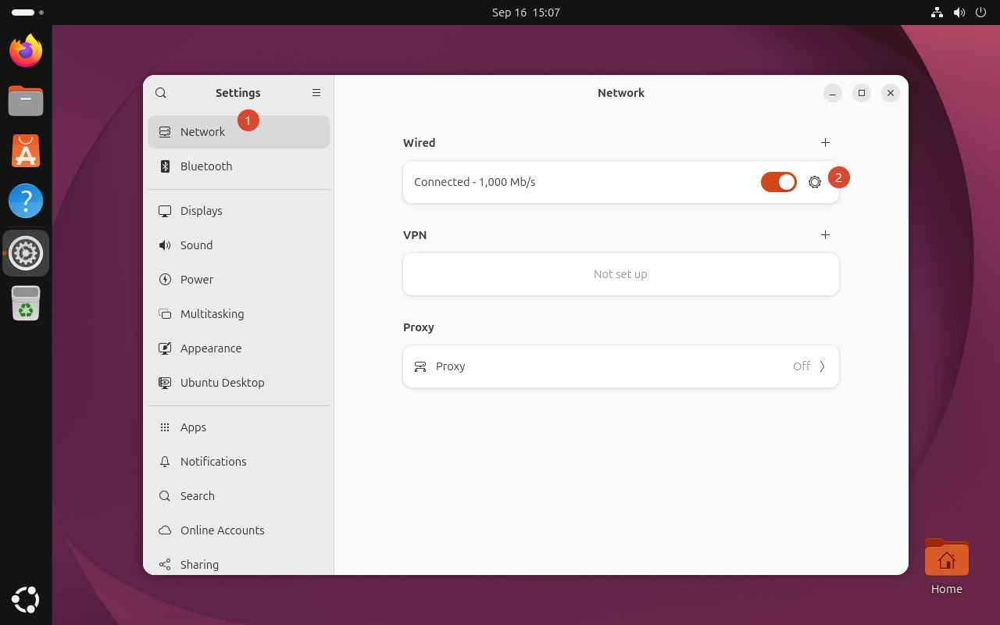
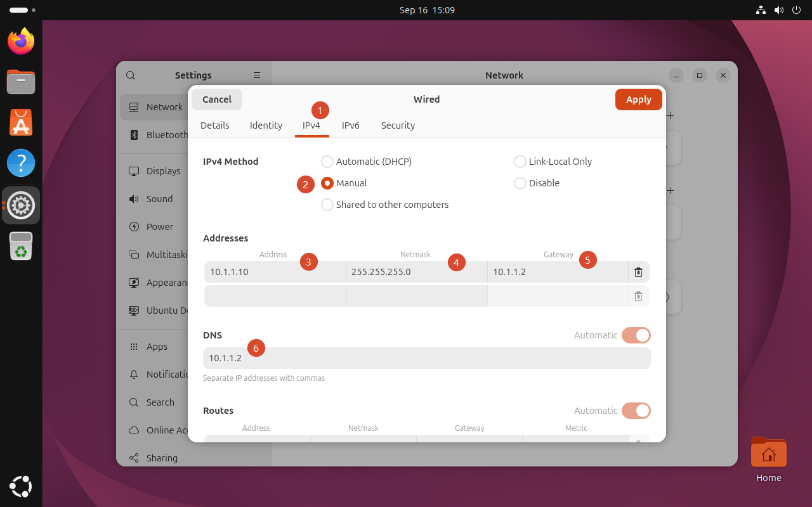
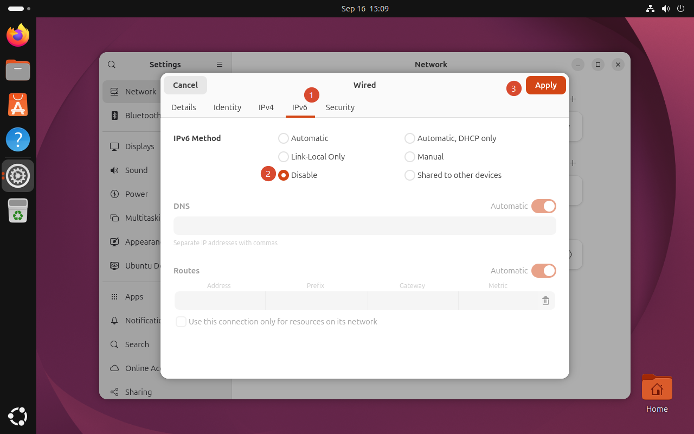
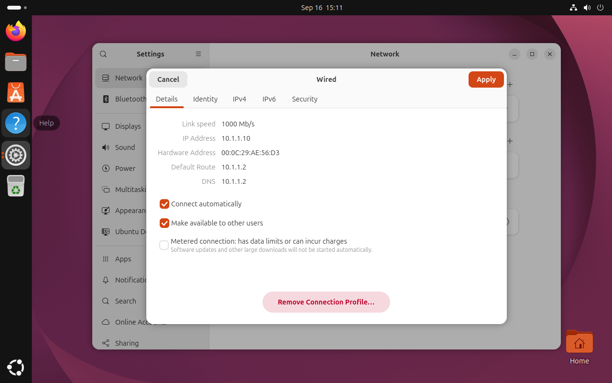
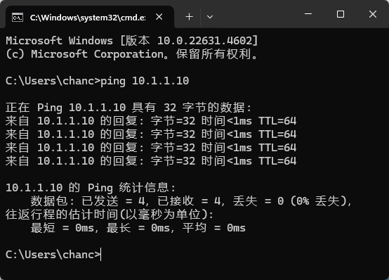
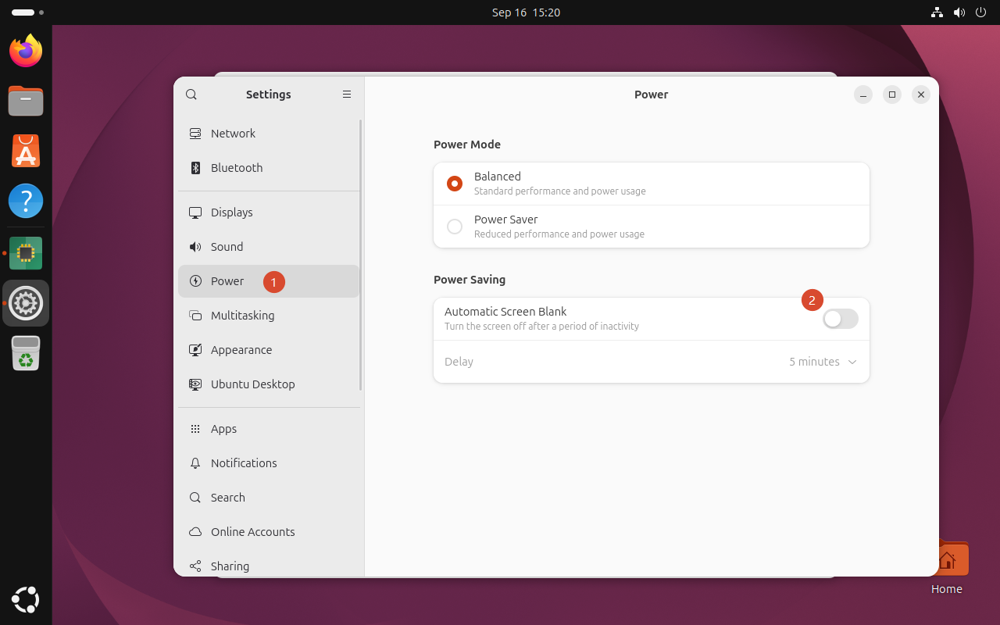
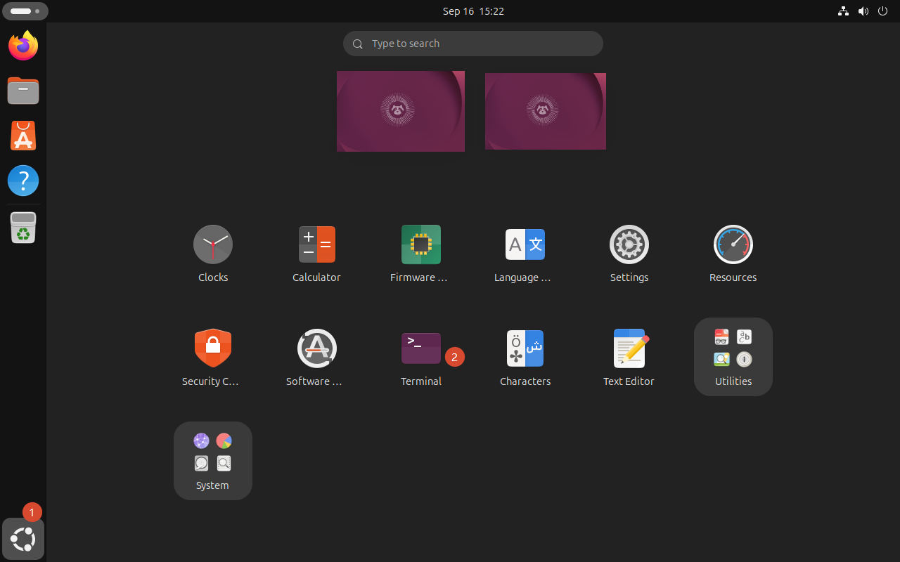
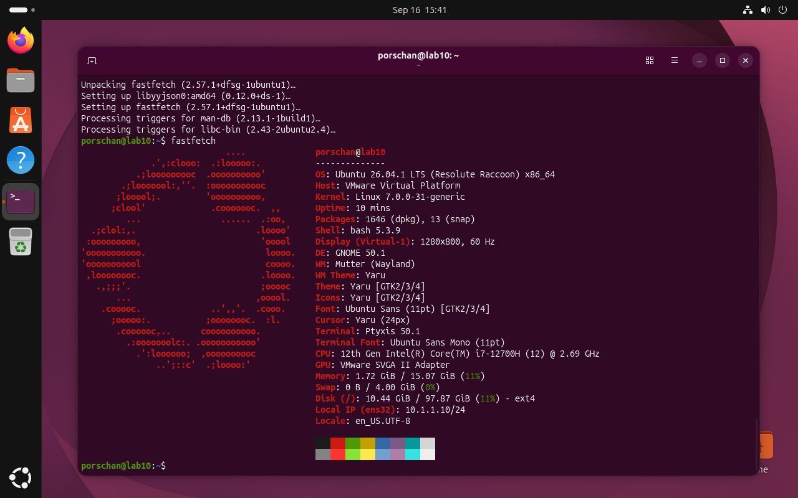
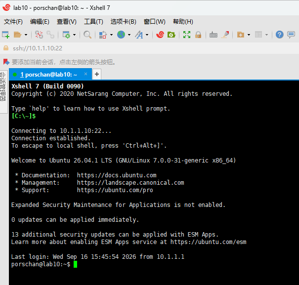

# Ubuntu 26.04 桌面版一些配置

## 固定IP

点击左下角图标 -> 点击 `Settings`



点击 `Network` -> 点击设置图标



点击 `IPv4`

1. 选中 `Manual`
2. 填写 `Addresses - Address` = `10.1.1.10`
3. 填写 `Addresses - Netmask` = `255.255.255.0`
4. 填写 `Addresses - Gateway` = `10.1.1.2`
5. 填写 `DNS` = `10.1.1.2`

根据实际情况填写



点击 `IPv6`

1. 选中 `Disable`

根据实际情况禁用



重新查看是否配置成功



宿主机查看是否联通



## 关闭屏幕保护

点击左下角图标 -> 点击 `Settings`


点击 `Power` -> 关闭 `Power Saving -> Automatic Screen Blank`



## 更换软件仓库

点击左下角图标 -> 点击 `Terminal`



备份 `ubuntu.sources` 文件

```shell
sudo cp -a /etc/apt/sources.list.d/ubuntu.sources /etc/apt/sources.list.d/bak.ubuntu.sources.20260916.disabled
```

修改 `ubuntu.sources` 文件

```shell
sudo nano /etc/apt/sources.list.d/ubuntu.sources
```

修改内容为

```sources
Types: deb
# 默认配置
# URIs: http://sg.archive.ubuntu.com/ubuntu/
# 清华大学 TUNA 镜像源
URIs: https://mirrors.tuna.tsinghua.edu.cn/ubuntu
Suites: resolute resolute-updates resolute-backports
Components: main restricted universe multiverse
Signed-By: /usr/share/keyrings/ubuntu-archive-keyring.gpg

Types: deb
URIs: http://security.ubuntu.com/ubuntu/
Suites: resolute-security
Components: main restricted universe multiverse
Signed-By: /usr/share/keyrings/ubuntu-archive-keyring.gpg
```

更新软件源索引

```shell
sudo apt update
```

升级系统

```shell
sudo apt upgrade -y
```

!!! info "参考链接："

    1. [Ubuntu 软件仓库 - DEB822 格式](https://mirrors.tuna.tsinghua.edu.cn/help/ubuntu/){target=blank}

    2. [Ubuntu 26.04 国内镜像源配置教程 - 解决 apt upgrade 慢的问题](https://my.oschina.net/ethanleellj/blog/19728245){target=blank}

## 安装 fastfetch

安装 fastfetch

```shell
sudo apt install -y fastfetch
```

内容输出



## 安装 ssh 服务

安装 ssh 服务

```shell
sudo apt install -y openssh-server
```

启动 ssh 服务

```shell
sudo systemctl enable --now ssh
```

查看 ssh 服务

```shell
systemctl status ssh
```

输出内容如下

```shell
porschan@lab10:~$ systemctl status ssh
● ssh.service - OpenBSD Secure Shell server
     Loaded: loaded (/usr/lib/systemd/system/ssh.service; enabled; preset: enabled)
     Active: active (running) since Wed 2026-09-16 15:45:10 CST; 5s ago
 Invocation: 5f6a2d83020e4bcd8785c521c289dd79
TriggeredBy: ● ssh.socket
       Docs: man:sshd(8)
             man:sshd_config(5)
    Process: 16031 ExecStartPre=/usr/sbin/sshd -t (code=exited, status=0/SUCCESS)
   Main PID: 16034 (sshd)
      Tasks: 1 (limit: 15081)
     Memory: 1.6M (peak: 2.2M)
        CPU: 44ms
     CGroup: /system.slice/ssh.service
             └─16034 "sshd: /usr/sbin/sshd -D [listener] 0 of 10-100 startups"

Sep 16 15:45:09 lab10 systemd[1]: Starting ssh.service - OpenBSD Secure Shell server...
Sep 16 15:45:10 lab10 sshd[16034]: Server listening on 0.0.0.0 port 22.
Sep 16 15:45:10 lab10 sshd[16034]: Server listening on :: port 22.
Sep 16 15:45:10 lab10 systemd[1]: Started ssh.service - OpenBSD Secure Shell server.
porschan@lab10:~$ 
```

宿主机连接 ubuntu 成功界面

