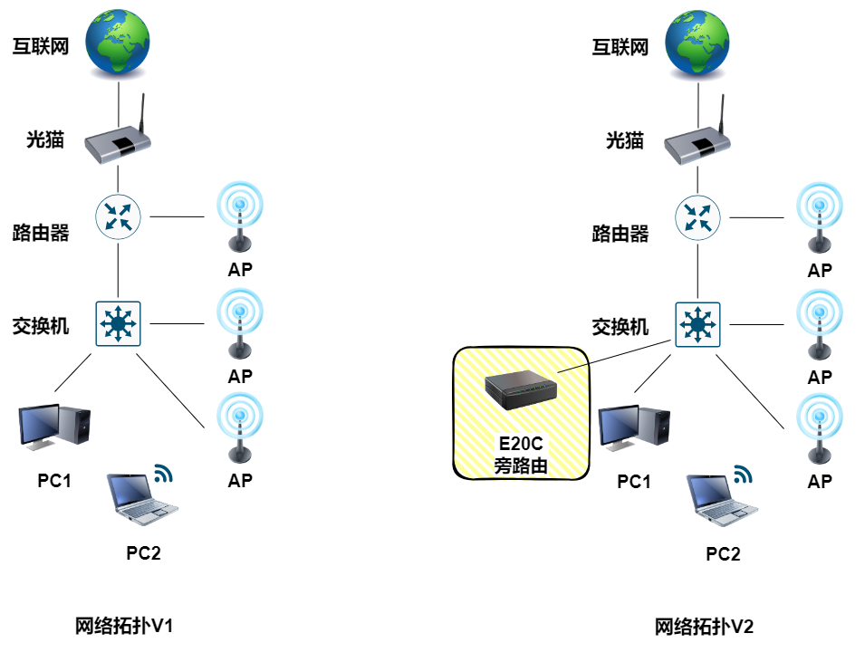

# iStoreOS 旁路由

## 背景

今天我用 `Radxa E20C` 作为旁路由实现一些特别的网络功能，网络拓扑从V1升级为V2，图片如下：



## 安装 iStoreOS

!!! info "参考链接"
    [E20C->上手指南->安装系统->安装系统到EMMC->Windows主机](https://docs.radxa.com/e/e20c/getting-started/install-os/maskrom/windows){target=blank}

创建目录 `01-DriverAssistant v5.0`， 下载 `DriverAssistant v5.0` ，并解压和安装

!!! info
    名称：`DriverAssistant v5.0`
    
    MD5：`E65036EE05D4102859F42811430E9C28`

    链接：https://dl.radxa.com/tools/windows/DriverAssitant_v5.0.zip

创建目录 `02-RKDevTool v2.96`，下载 `RKDevTool v2.96` ，并解压

!!! info
    名称：`RKDevTool_Release_v2.96_zh.zip`

    MD5：`25EC32EBC08F9483E21CEE8818C98588`

    链接：https://dl.radxa.com/tools/windows/RKDevTool_Release_v2.96_zh.zip

创建目录 `03-Loader_文件`，下载 `rk3528_spl_loader_v1.07.104.bin` 的 Loader 文件

!!! info
    名称：`rk3528_spl_loader_v1.07.104.bin`

    MD5：`EB24CB0A813EFE86BA5749585B16A1E2`

    链接：https://dl.radxa.com/rock2/images/loader/rk3528_spl_loader_v1.07.104.bin

创建目录 `04-iStoreOS_系统镜像`，下载 `istoreos-22.03.7-2025050912-e20c-squashfs.img.gz` 的iSoreOS 系统镜像文件，并解压

!!! info
    名称：`istoreos-22.03.7-2025050912-e20c-squashfs.img.gz`

    MD5：`7FE1F9F7428EBD48902F13C093B4B3BA`

    链接：https://fw20.koolcenter.com/iStoreOS/e20c/istoreos-22.03.7-2025050912-e20c-squashfs.img.gz

使 `E20C` 进入 `Maskrom 模式`

- 打开 `02-RKDevTool v2.96\RKDevTool_Release_v2.96_zh\RKDevTool_Release_v2.96\RKDevTool.exe`
- 将数据线连接到 `PC2` 以及将另外一端连接到 `E20C` 的 `DEBUG` 口
- 用 `卡针` 长按 `MASKROM` 按键
- 给 `E20C` 的 `POWER` 口上电
- 在 `瑞芯微开发工具 v2.96` 软件中显示 `发现一个MASKROM设备` 提示即可松开 `MASKROM` 按键的按压
- 设置 `Loder` 的路径
- 设置 `Image` 的存储为 `EMMC`
- 设置 `Image` 的路径
- 勾选 `强制按地址写`
- 点击 `执行`，等待完成即可拔出 `E20C` 的 `DEBUG` 口上的数据线

## 设置旁路由

设置 `iStoreOS` 旁路由

- 将网线一端连接 `交换机`，另外一端连接 `E20C` 的 `WAN` 口
- 将网线一端连接 `E20C` 的 `LAN` 口，另外一端连接 `PC2` 的网口
- 等待 `PC2` 获取到 `有线网卡分配的IP地址` 后，使用浏览器访问 `192.168.100.1`
- 默认账号为 `root`，默认密码：`password`
- 点击左侧的 `网络向导` -> `配置为旁路由` -> `自动配置...` -> `点击刷新` -> `自动填写...` ，填写内容如下

    ```
    IP 地址：192.168.16.60
    子网掩码：255.255.255.0
    网关地址：192.168.16.254
    DNS服务器：192.168.16.254
    【去掉勾选】提供 DHCPv4 服务（需要关闭主路由 DHCP 服务）
    【去掉勾选】自动获取 IPV6（即开启 DHCPv6 客户端）
    【去掉勾选】开启 NAT（可修复某些无线热点不能访问外网问题）
    ```

- 断开`E20C` 的 `WAN` 口
- 断开`E20C` 的 `LAN` 口
- 将网线一端连接 `交换机`，另外一端连接 `E20C` 的 `LAN` 口
- 使用浏览器访问 `192.168.16.60` 的 iStoreOS 管理后台，并登录（账号密码参考6.4步骤）
- 在首页中点击 `DNS配置`，保存信息如下

    ```
    DNS服务器地址：192.168.16.254
    备用DNS服务器地址：223.5.5.5（阿里云公共DNS）
    ```

检查 `iStoreOS` 旁路由是否正常

- 在线升级 iStoreOS ，查看是否正常
- 在 iStore 中安装软件，查看是否正常（安装 `关机` 软件）
- 打流，查看流量是否经过旁路由，操作步骤如下：
    - 设置固定IP如下：

    ```
    IP 地址：192.168.16.38
    子网掩码：255.255.255.0
    网关地址：192.168.16.60（旁路由IP）
    首选 DNS 服务器：192.168.16.60（旁路由IP）
    备用 DNS 服务器：223.5.5.5（阿里云公共DNS）
    ```
    - 浏览器访问 [流量消失器](http://llss.atewm.cn/){target=blank}，点击开始
    - 点击左侧的 `状态` -> `实时信息` -> `连接` -> 查看源地址 `192.168.16.38` 的传输流量是否增大，确认旁路由使用正常