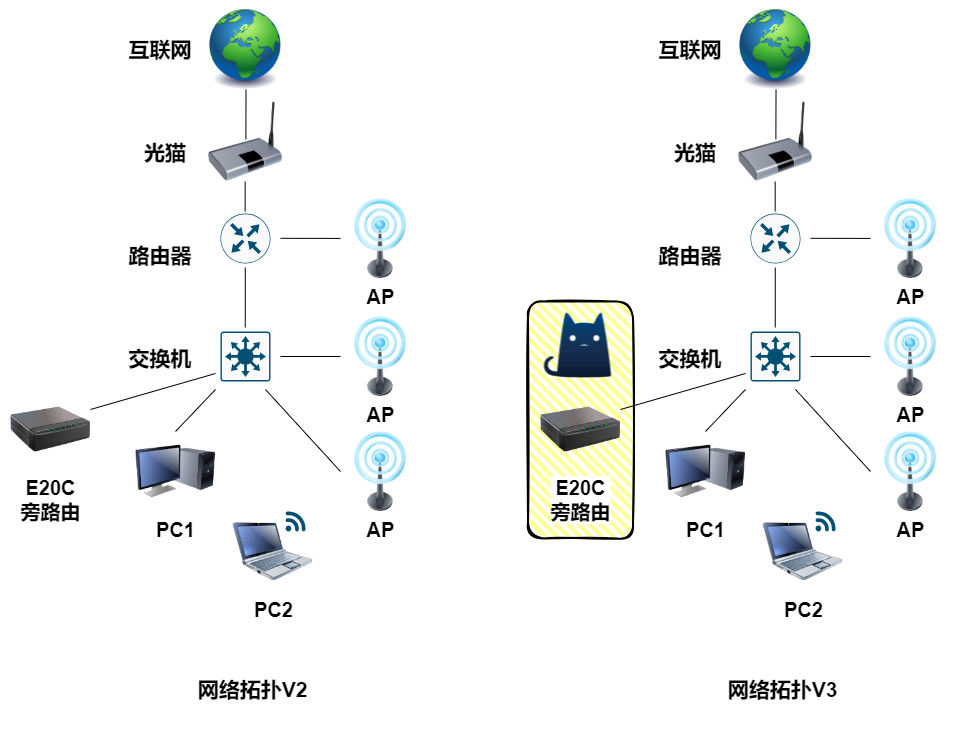

# iStoreOS 旁路由 OpenClash

## 背景

今天我用 Radxa E20C 作为旁路由实现一些特别的网络功能，网络拓扑从V2升级为V3，图片如下：



!!! info "参考链接"
    在 iStoreOS 中安装 openClash：

    [【全网最全】OpenClash零基础入门教程 _ openclash优缺点、网络设置、安装、内核更新与上传、基础设置，新手使用指南，openwrt软路由Open](https://www.bilibili.com/video/BV1GmiMe8EsK/){target=blank}

创建目录 `01-OpenClash_ipk文件`， 下载 `luci-app-openclash_0.46.079_all.ipk`

!!! info
    下载列表页面：[github vernesong/OpenClash 仓库中的 Releases](https://github.com/vernesong/OpenClash/releases){target=blank}

    文件名称：`luci-app-openclash_0.46.079_all.ipk`

    MD5：`C1D0A193E850E63BBF6A561A524A2AF7`

    下载链接：https://github.com/vernesong/OpenClash/releases/download/v0.46.079/luci-app-openclash_0.46.079_all.ipk


创建目录 `02-clash-linux-arm64文件`， 下载 `clash-linux-arm64.tar.gz`

!!! info
    文件名称：`clash-linux-arm64.tar.gz`

    MD5：`95058372DA6F3FEBADE6A72551069B77`

    下载链接：https://raw.githubusercontent.com/vernesong/OpenClash/core/master/meta/clash-linux-arm64.tar.gz


创建目录 `03-订阅URL`， 创建 `订阅URL.txt` 并编写一下内容：

```txt
在订阅的配置的URL获取
```

## iStoreOS 安装并配置 openClash

使用浏览器登录 iStoreOS (http://192.168.16.60)

默认账号：`root`，默认密码：`password`

安装依赖

在 `首页` 点击 `终端`，输入默认的账号密码

```shell
# 更新软件包列表
opkg update
# 安装依赖（参考链接：https://github.com/vernesong/OpenClash/wiki/%E5%AE%89%E8%A3%85）
opkg install luci luci-base iptables dnsmasq-full coreutils coreutils-nohup bash curl jsonfilter ca-certificates ipset ip-full iptables-mod-tproxy kmod-tun luci-compat
```

选择 `iStore` -> `手动安装` -> 上传 `01-OpenClash_ipk文件\luci-app-openclash_0.46.079_all.ipk`

选择 `服务` -> `OpenClash`

页面显示 `您还未安装内核，是否立即下载安装？`，点击确认

选择 `插件设置` -> `版本更新`

可以查看 `[Meta] 当前内核版本` 显示 `文件不存在`

选择 `配置管理` -> `上传文件类型 (点击选择) ` -> 选择 `[Meta]内核文件（.tar.gz）` -> 选择 `02-clash-linux-arm64文件\clash-linux-arm64.tar.gz` -> 点击 `上传`

显示绿色的提示 `文件已成功上传到 "/etc/openclash/core/"` 表示上传成功

选择 `插件设置` -> `版本更新`

可以查看 `[Meta] 当前内核版本` 显示 `		alpha-g8bc6f77`，内核版本更新成功

选择 `配订阅` -> `编辑配置文件订阅信息` -> `新增`

```txt
配置文件名：magic_config
订阅地址：在订阅的配置的URL获取
```

其他保存默认，点击 `保存配置`

点击底部 `更新配置`

自动跳转到 `运行状态`，查看 `网站访问检查`，检查是否成功

选择 `运行状态`，点击 `配置订阅`，查看订阅信息

选择 `配置订阅`，勾选自动更新，将以下内容配置

```txt
自动更新：勾选
更新模式：预约
更新时间(每周)：每天
更新时间(每天)：0:00
```

填写完成后，点击底部 `保存配置`

检查 `iStoreOS` 旁路由的 `OpenClash` 是否正常

固定IP

```txt
IP 地址：192.168.16.38
子网掩码：255.255.255.0
网关地址：192.168.16.60（旁路由IP）
首选 DNS 服务器：192.168.16.60（旁路由IP）
备用 DNS 服务器：223.5.5.5（阿里云公共DNS）
```

- 使用 `tcping google.com 443` 或者 `tcping youtube.com 443`,显示 `Probing 198.18.0.20:443/tcp - Port is open - time=3.530ms` 即可代表成功
- 浏览器访问 `google.com` 并且搜索 `lofi girl`，能正常跳转并且能播放直播，即可代表成功