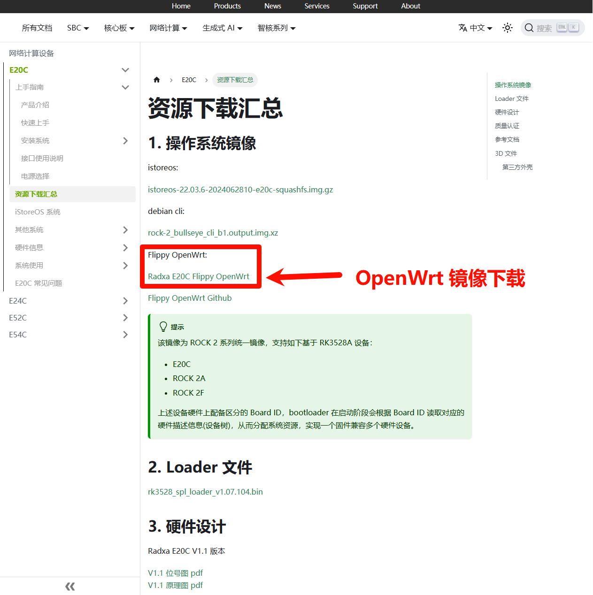

# Radxa E20C 安装 OpenWrt

## 背景
今天浏览 `Radxa E20C` 官方文档中无意中发现设备可以安装 `OpenWrt`，如下图：

- [Radxa E20C 官方文档](https://docs.radxa.com/e/e20c/download){target=blank}

## 安装 OpenWrt

!!! info "参考链接"
    [E20C->上手指南->安装系统->安装系统到EMMC->Windows主机](https://docs.radxa.com/e/e20c/getting-started/install-os/maskrom/windows){target=blank}

1. 创建目录 `01-DriverAssistant v5.0`， 下载 `DriverAssistant v5.0` ，并解压和安装

!!! info
    名称：`DriverAssistant v5.0`

    MD5：`E65036EE05D4102859F42811430E9C28`

    链接：https://dl.radxa.com/tools/windows/DriverAssitant_v5.0.zip

2. 创建目录 `02-RKDevTool v2.96`，下载 `RKDevTool v2.96` ，并解压

!!! info
    名称：`RKDevTool_Release_v2.96_zh.zip`

    MD5：`25EC32EBC08F9483E21CEE8818C98588`

    链接：https://dl.radxa.com/tools/windows/RKDevTool_Release_v2.96_zh.zip

3. 创建目录 `03-Loader_文件`，下载 `rk3528_spl_loader_v1.07.104.bin` 的 Loader 文件

!!! info
    名称：`rk3528_spl_loader_v1.07.104.bin`

    MD5：`EB24CB0A813EFE86BA5749585B16A1E2`

    链接：https://dl.radxa.com/rock2/images/loader/rk3528_spl_loader_v1.07.104.bin

4. 创建目录 `04-OpenWrt_系统镜像`，下载 `openwrt_rk3528_e20c_R24.07.07_k5.10.160-rk35xx-flippy-2407a.7z` 的 OpenWrt 系统镜像文件，并解压

!!! info
    名称：`openwrt_rk3528_e20c_R24.07.07_k5.10.160-rk35xx-flippy-2407a.7z`

    MD5：`CDFF60177188E44BB80DD05E4E626A82`

    链接：https://dl.radxa.com/e/e20c/image/openwrt_rk3528_e20c_R24.07.07_k5.10.160-rk35xx-flippy-2407a.7z

5. 使 `E20C` 进入 `Maskrom 模式`

	- 打开 `02-RKDevTool v2.96\RKDevTool_Release_v2.96_zh\RKDevTool_Release_v2.96\RKDevTool.exe`
	- `E20C 的 DEBUG 口` --- 使用数据线连接 --- `Windows 主机`
	- 用 `卡针` 长按 `MASKROM` 按键
	- 给 `E20C` 的 `POWER` 口上电
	- 在 `瑞芯微开发工具 v2.96` 软件中显示 `发现一个MASKROM设备` 提示即可松开 `MASKROM` 按键的按压
	- 设置 `Loder` 的路径
	- 设置 `Image` 的存储为 `EMMC`
	- 设置 `Image` 的路径
	- 勾选 `强制按地址写`
	- 点击 `执行`，等待完成即可拔出 `E20C` 的 `DEBUG` 口上的数据线

# 访问 OpenWrt 的管理后台

`E20C 的 LAN 口` --- 使用网线连接 --- `Windows 主机`

浏览器中访问 `http://192.168.1.1`，默认账号：`root`，默认密码：`password`

!!! info
    该版本的 OpenWrt 虽然不是最新版本，但是编译的作者将很多功能也打包进系统中，省去了查找固件以及版本匹配的问题，在此感谢编译的作者
