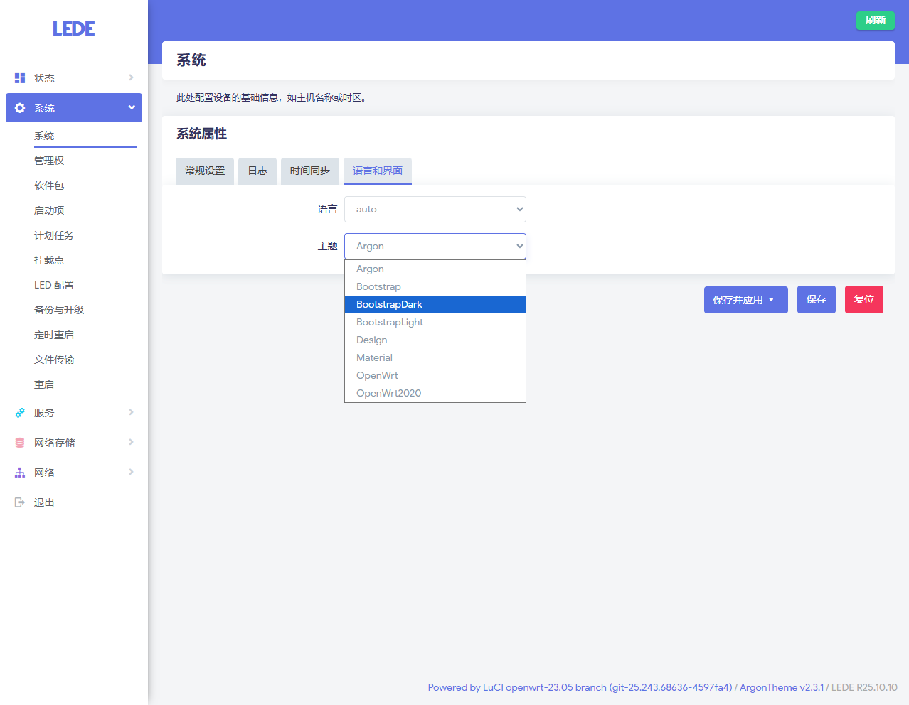
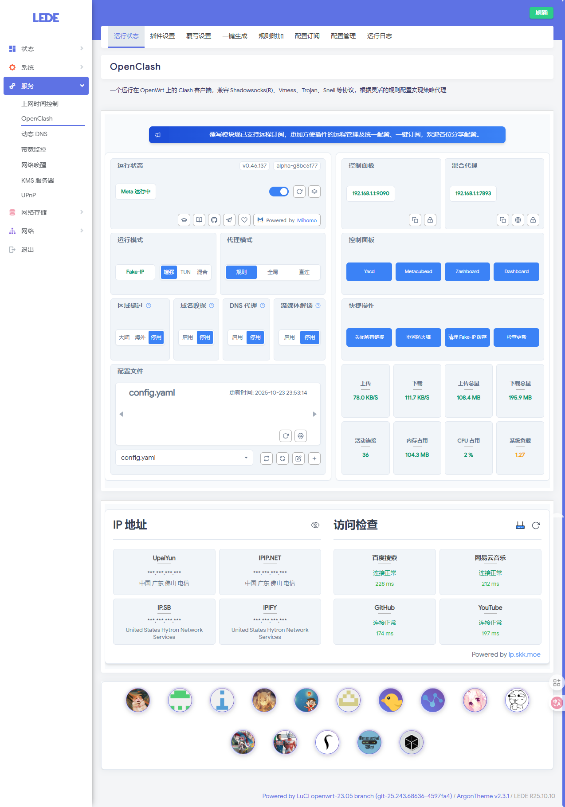

# Radxa E20C 安装 LEDE（含编译过程）（含所有主题）（含OpenClash）

## 操作过程

初次安装、编译过程请参考过往教程

进入工作目录

```shell
cd /media/porschan/lede.project/lede
```

刷新软件包清单

```shell
./scripts/feeds update -a
```

安装清单中的软件包

```shell
./scripts/feeds install -a
```

配置系统

这里为了方便展示，将 `.config` 删除（可选操作）

```shell
sudo rm -rf /media/porschan/lede.project/lede/.config
```

配置系统

```shell
make menuconfig
```

这里只配置了以下 5 项内容，可根据自己需求添加额外的功能模块

- `Target System` 选择了 `Rockchip`
- `Subtarget` 默认选择了 `RK33xx/RK35xx boards (64bit)`
- `Target Profile` 选择了 `Radxa E20C`
- `LuCI` -> `3. Applications` 选择了 `luci-app-openclash. LuCI support for clash`
- `LuCI` -> `4. Themes` 选择了 `全部主题`

 下载 dl 库（-j 后面是线程数，第一次编译推荐用单线程）

```shell
make download -j8
```

编译固件（-j 后面是线程数，第一次编译推荐用单线程）

```shell
make V=s -j$(nproc)
```

将 `E20C` 刷新固件

下图为系统的主题列表



下图为OpenClash的正常应用界面（默认只安装了软件，未安装内核文件）

