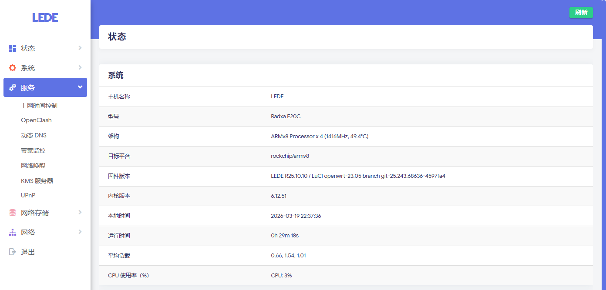
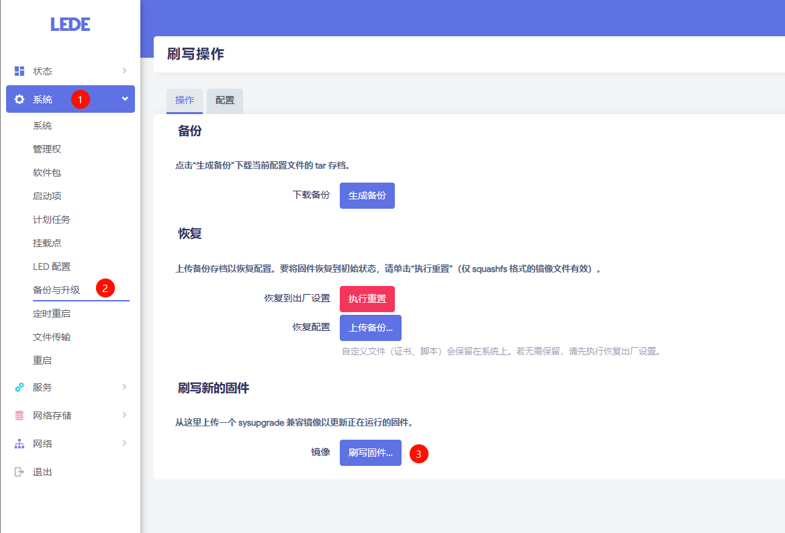
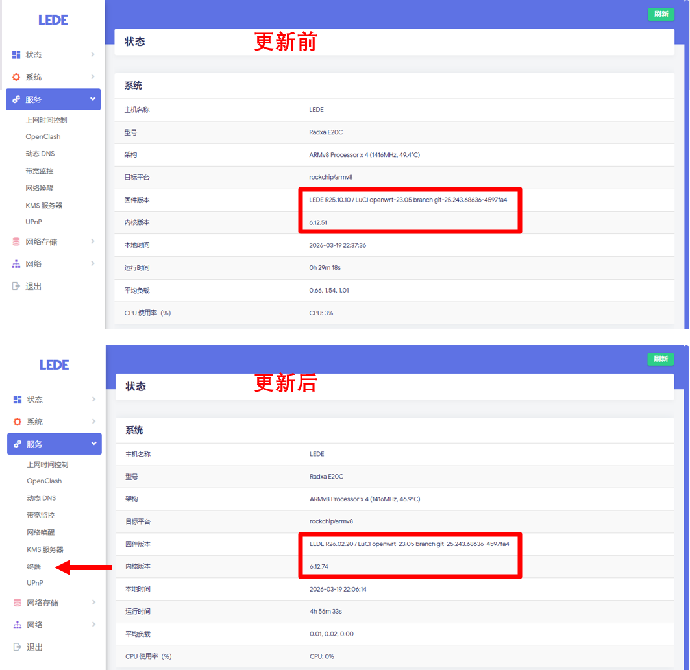

# Radxa E20C 升级 LEDE（含编译过程）

## 操作过程

查看 LEDE 系统状态以及服务中的模块，如下图所示



初次安装、编译过程请参考过往教程

打开虚拟机

为虚拟机添加快照，名称为 `更新LEDE系统前`

进入工作目录

```shell
cd /media/porschan/lede.project/lede
```

保持和远程仓库版本一致，如下为版本不一致

```shell
porschan@lab10:/media/porschan/lede.project/lede$ git status
On branch master
Your branch is up to date with 'origin/master'.

Changes not staged for commit:
  (use "git add <file>..." to update what will be committed)
  (use "git restore <file>..." to discard changes in working directory)
	modified:   config/Config-build.in
	modified:   config/Config-devel.in
	modified:   config/Config-images.in
	modified:   config/Config-kernel.in

no changes added to commit (use "git add" and/or "git commit -a")
```

丢弃所有本地修改

```shell
git reset --hard
```

再次查询版本情况

```shell
porschan@lab10:/media/porschan/lede.project/lede$ git status
On branch master
Your branch is up to date with 'origin/master'.

nothing to commit, working tree clean
```

拉取远程更新

```shell
git pull
```

下载最新的软件包列表

```shell
./scripts/feeds update -a
```

安装清单中的软件包

```shell
./scripts/feeds install -a
```

这里为了方便展示，将 `.config 目录` 删除

```shell
sudo rm -rf /media/porschan/lede.project/lede/.config
```

打开配置菜单界面

```shell
make menuconfig
```

这里只配置了以下 5 项内容，可根据自己需求添加额外的功能模块

- `Target System` 选择了 `Rockchip`
- `Subtarget` 默认选择了 `RK33xx/RK35xx boards (64bit)`
- `Target Profile` 选择了 `Radxa E20C`
- `LuCI` -> `3. Applications` 选择了 `luci-app-openclash. LuCI support for clash`
- `LuCI` -> `3. Applications` 选择了 `luci-app-ttyd. ttyd - Command-line tool for sharing teminal over the web`
- `LuCI` -> `4. Themes` 选择了 `全部主题`

下载编译所需的源代码包

```shell
make download -j8
```

编译固件

```shell
make V=s -j$(nproc)
```

将 `/media/porschan/lede.project/lede/bin/targets/rockchip/armv8` 下的 `openwrt-rockchip-armv8-radxa_e20c-squashfs-sysupgrade.img.gz` 拷贝到本地
 
解压 `openwrt-rockchip-armv8-radxa_e20c-squashfs-sysupgrade.img.gz` 得到 `openwrt-rockchip-armv8-radxa_e20c-squashfs-sysupgrade.img` 固件
 
打开 LEDE 管理后台，点击 `系统` -> `备份与升级` -> `刷写固件` -> `上传` `openwrt-rockchip-armv8-radxa_e20c-squashfs-sysupgrade.img` 固件，操作位置如下图



等待固件刷写成功后查看固件版本以及是否添加 `终端` 模块，如下图所示

