# J4125 安装 OPNsense

## 操作过程

### 下载镜像

下载 `OPNsense-26.1.6-dvd-amd64.iso` ，并解压

!!! success "下载链接"
    下载网站：https://opnsense.org/download/

    名称：`OPNsense-26.1.6-dvd-amd64.iso`

    SHA256：`6BA3633D9C0F96D82C792015A45F4B8AAC45EA8FA2BDBA3C5E534D0C90A4F08C`

    链接：https://mirrors.pku.edu.cn/opnsense/releases/26.1.6/OPNsense-26.1.6-dvd-amd64.iso.bz2

下载界面如下图所示

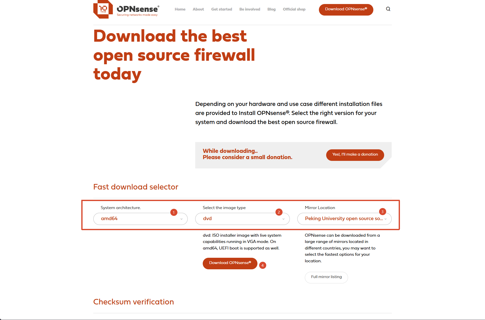

校验码如下图所示

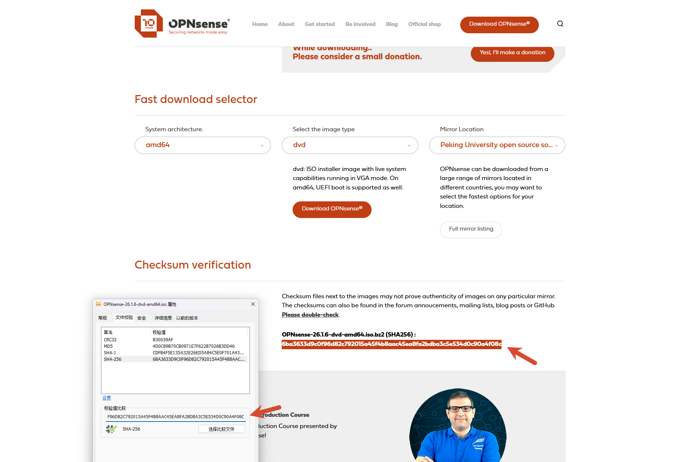

### 清空磁盘分区

!!! info "注意"
    此次使用 ventoy + WePE 来安装 ISO 文件，此次不做操作

清空您的系统盘

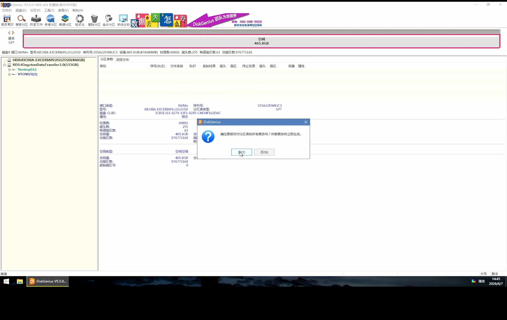

### 安装 OPNsense

选择对应的 OPNsense 的镜像文件，默认账号：`installer`，默认密码：`opnsense`

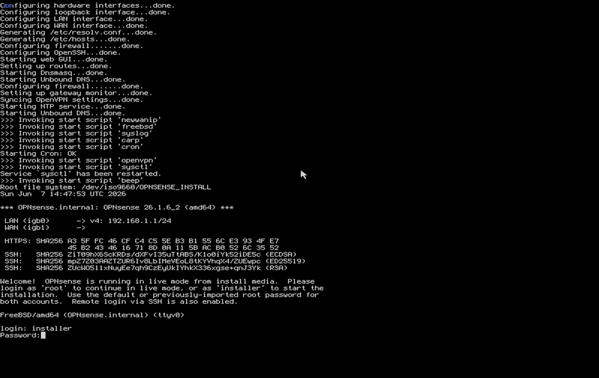

选择 `默认`

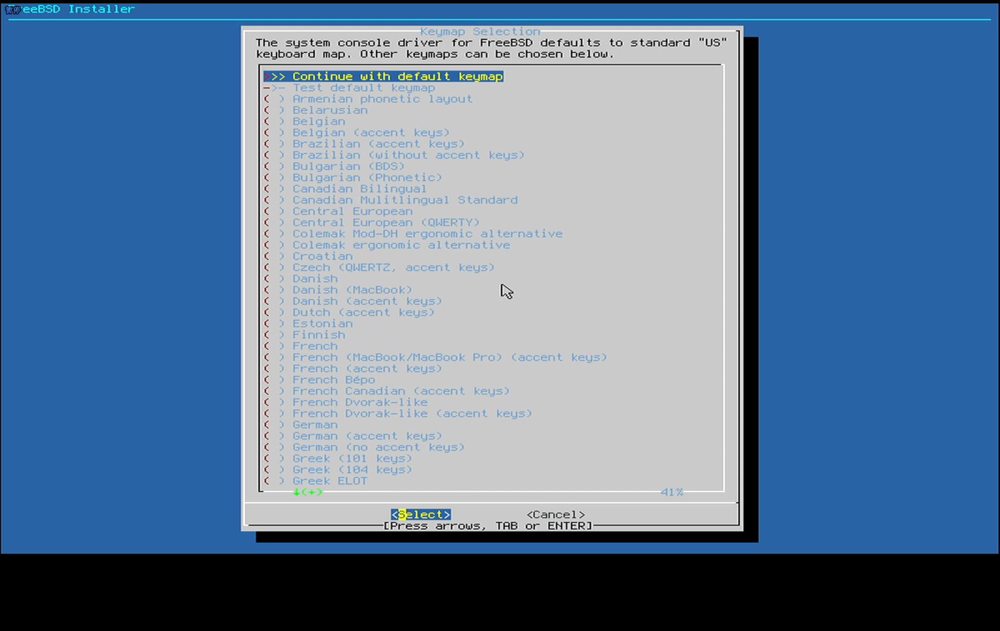

选择 `默认`

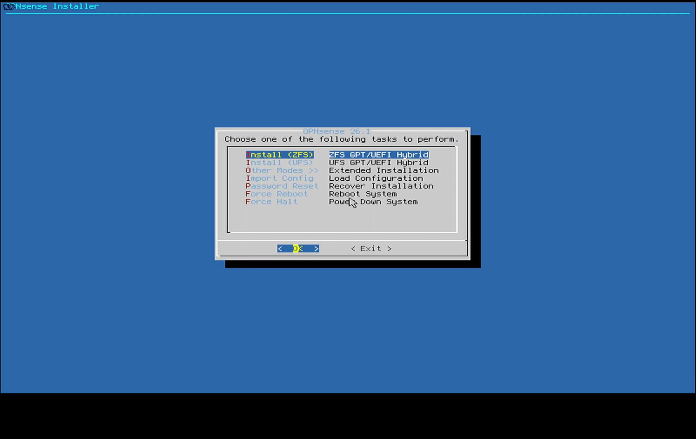

等待界面

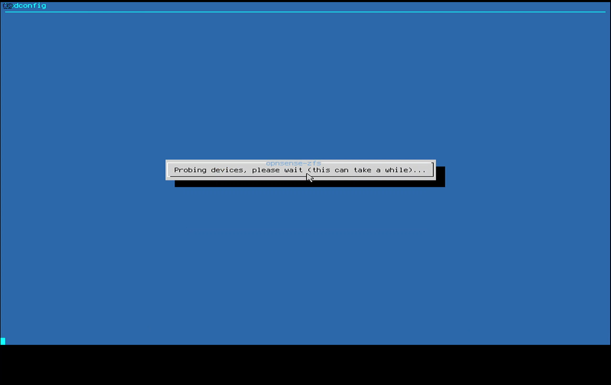

选择 `默认`

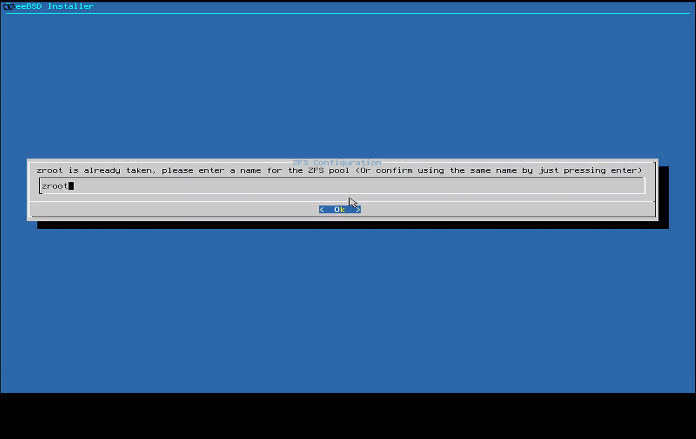

选择 `默认`

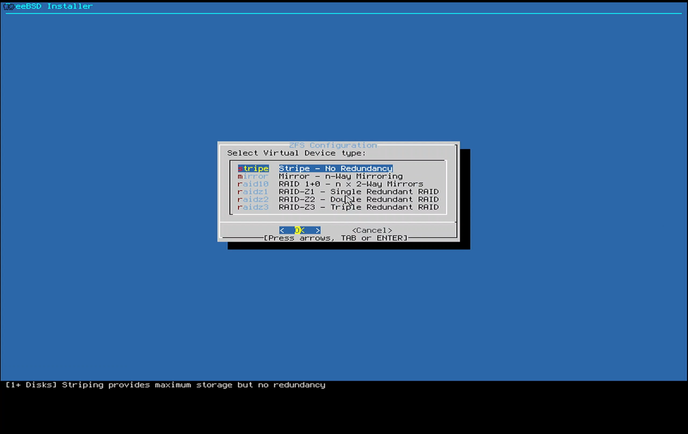

选择 `默认`

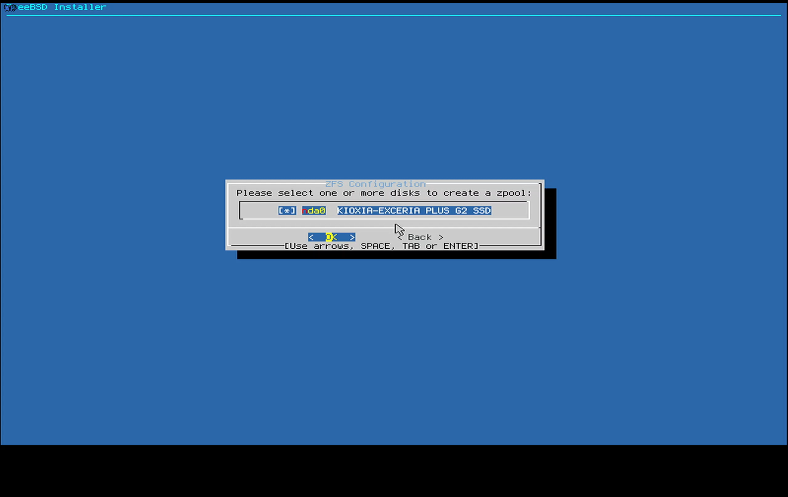

选择 `YES`

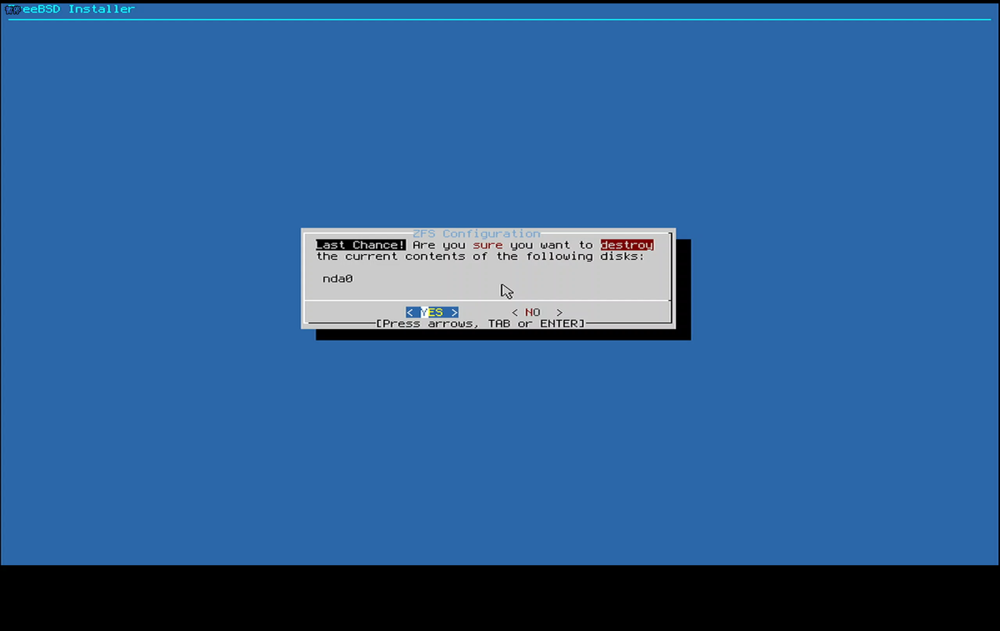

等待界面

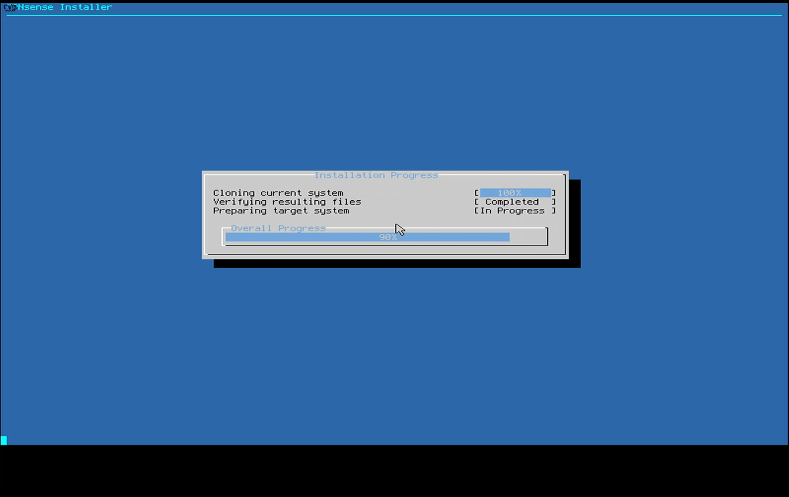

选择 `ROOT Password`

输出首次密码

输出确认密码

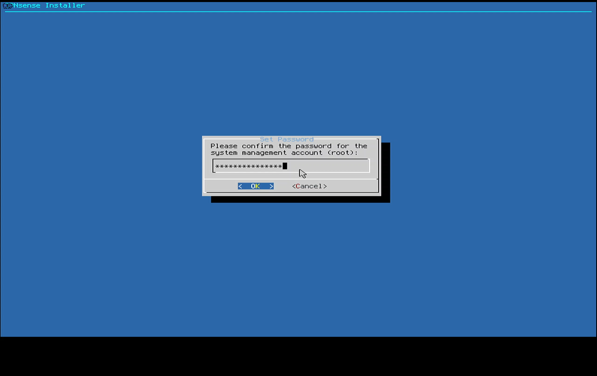

选择 `Complete Install`

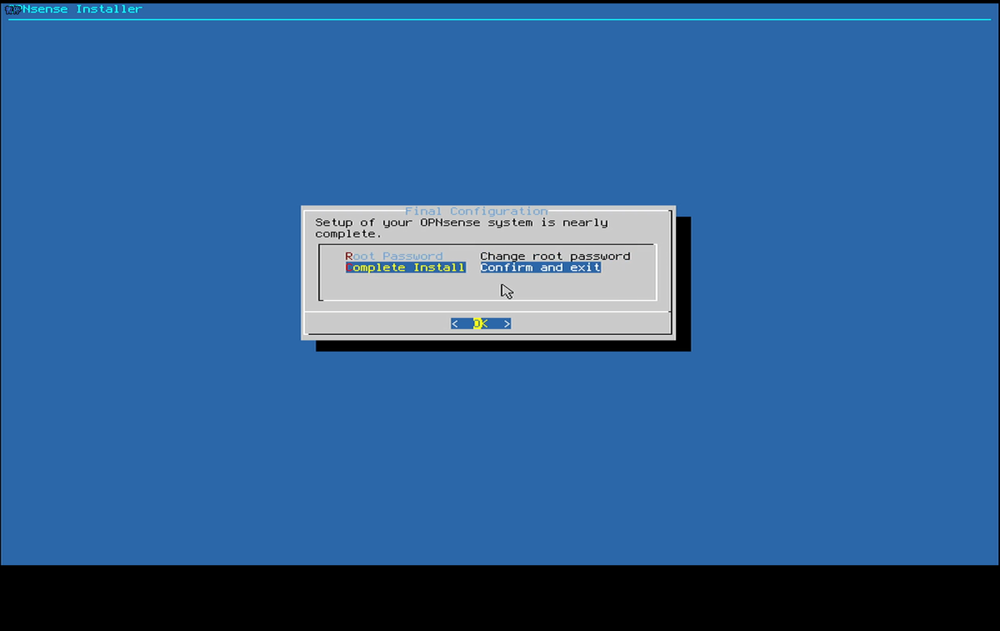

选择 `Reboot now`

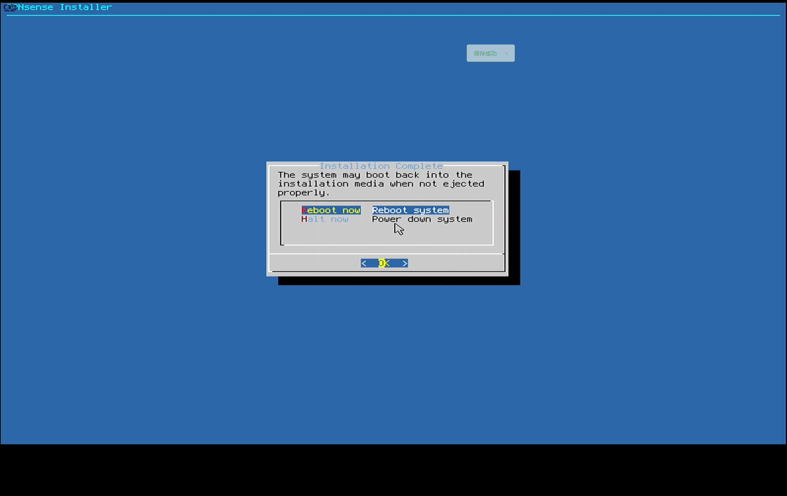

登录界面，默认账号：`root`，密码为初始化过程中设置的密码

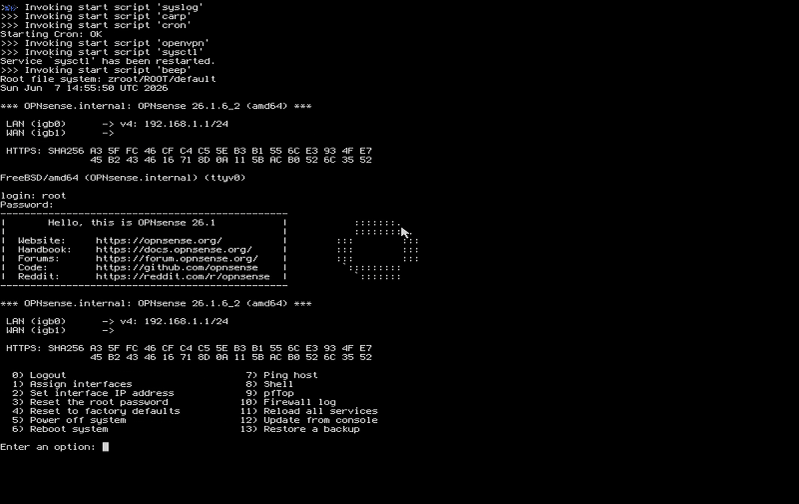

!!! info "注意"
    安装过程中设备全程无连接任何网线！

!!! info "参考连接"
    1. [【赛博堡垒 】PVE 部署 OPNsense 完全指南：打造家庭网络“门神”](https://www.bilibili.com/video/BV19bDGBUELi){target=blank}
