# J4125 - OPNsense 简单使用

## PC 访问 OPNsense

从控制台中查看 `LAN` 网关，注意此处需要记住 `LAN` 和 `igb0` 的关系

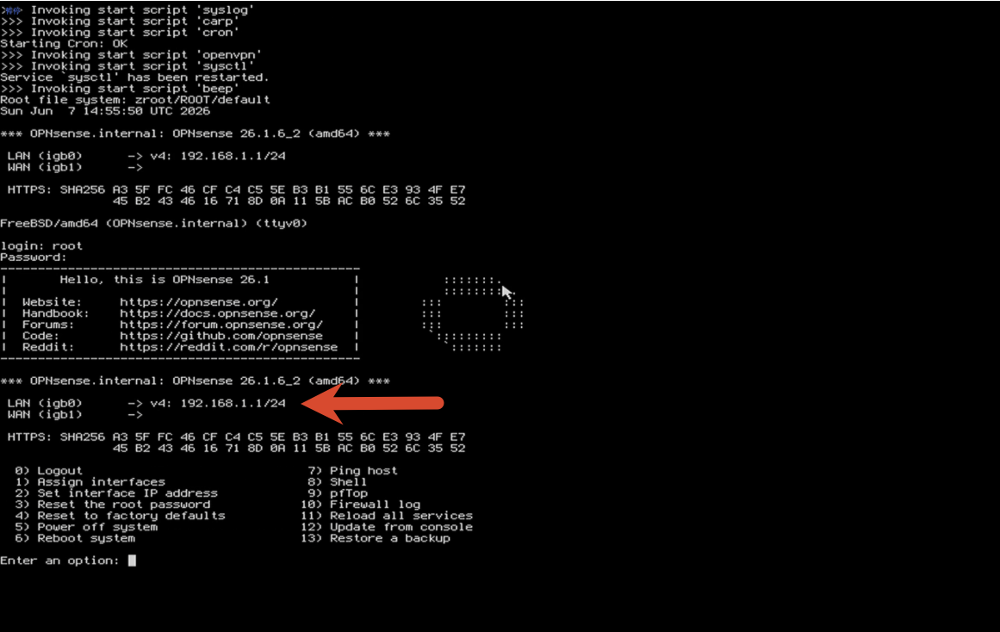

将 PC 和 J4125 使用网线连接，注意每台设备可能出现不一致情况，根据实际情况判断操作

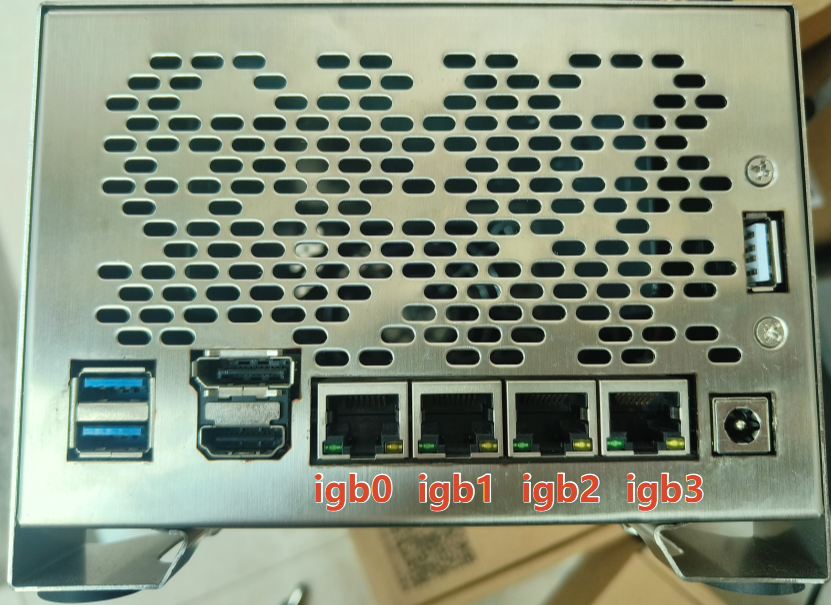

将 PC 的有线网卡设置为 DHCP 获取IP的方式

!!! info "注意"
    你的电脑将得到一个 IP，IP范围 从 `192.168.1.100` 到 `192.168.1.199`

浏览器访问 `https://192.168.1.1`，账号为 `root`，密码为自己设置的密码

成功登录界面（跳过设置向导）

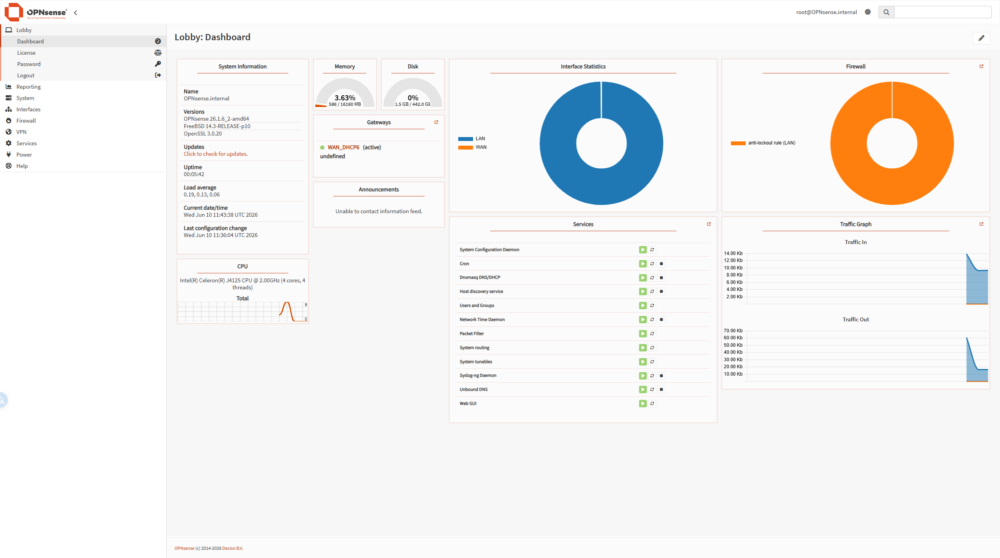

## 设置语言为 简体中文

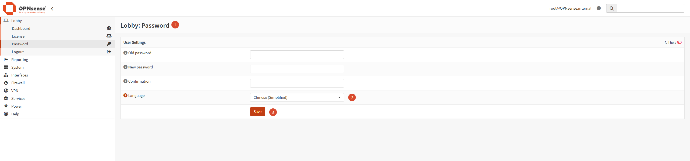

## 设置系统语言为 简体中文 以及 UTC + 8

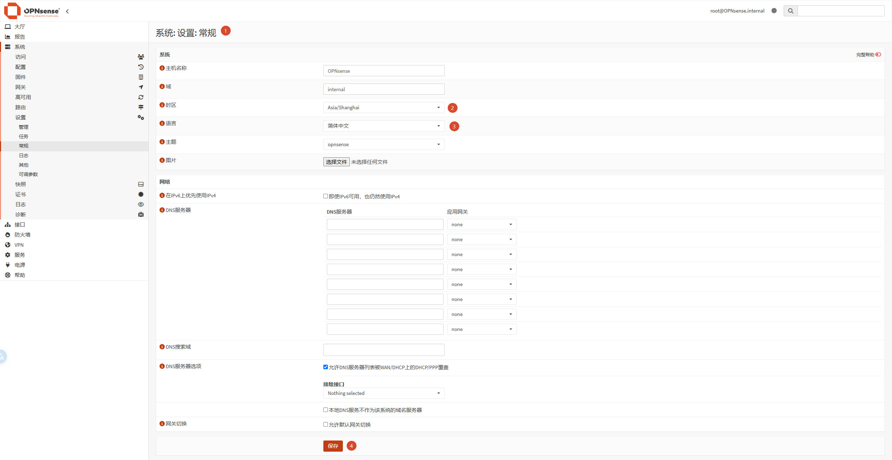

## OPNsense 接入 局域网（WAN - DHCP）

打开 系统:网关：设置

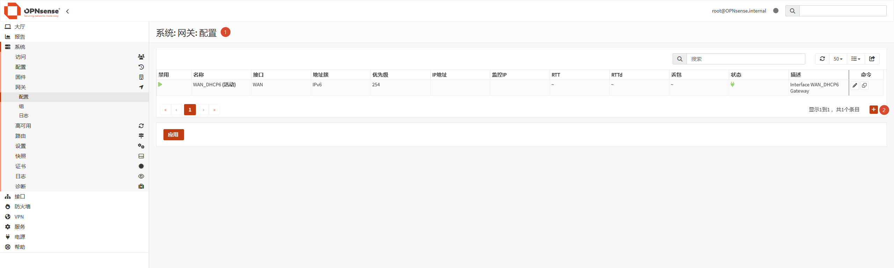

配置如下：

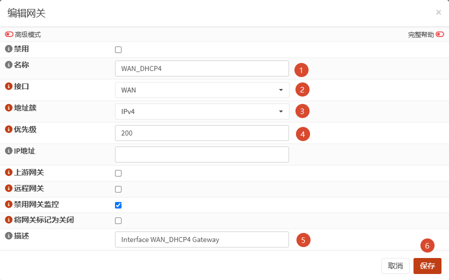

添加完成后，点击 `应用`

将 WAN 口配置至 igb3

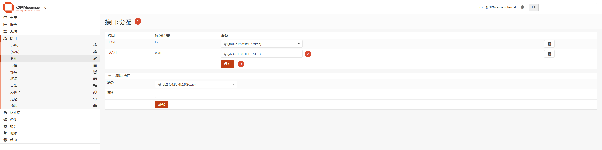

编辑 WAN 使用 DHCP 获取IP

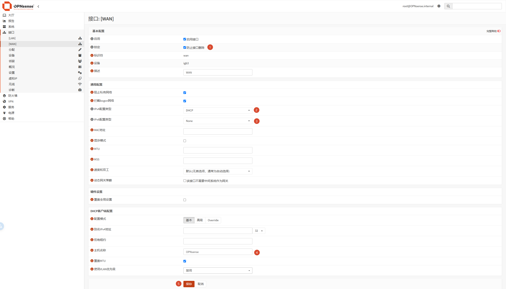

添加完成后，点击 `应用更改`

将OPNsense 连接局域网

## OPNsense 升级

打开下图，编辑镜像地址

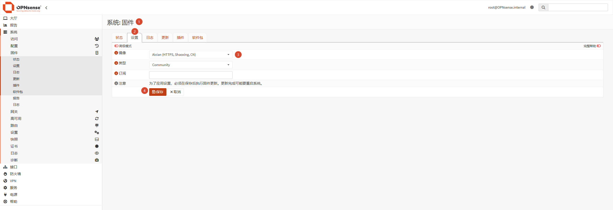

检查升级

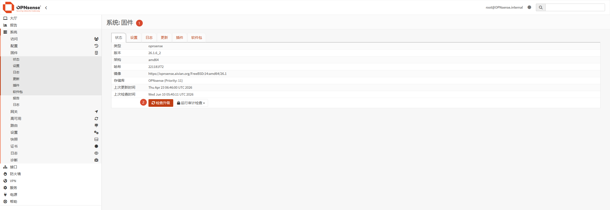

点击【更新】

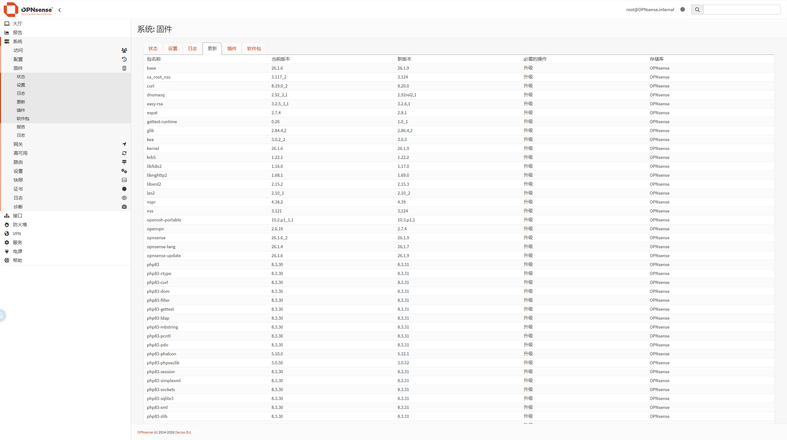

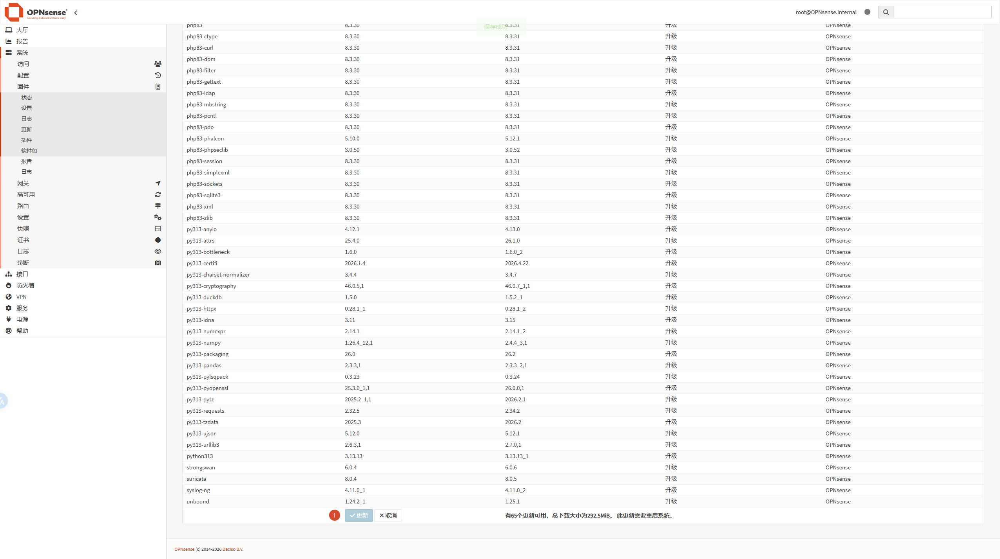

重启 OPNsense，查看固件版本

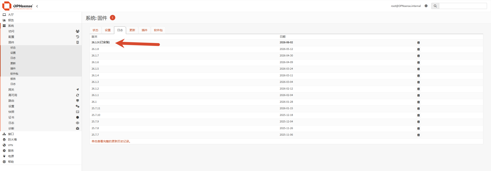

## 删除多余的网关

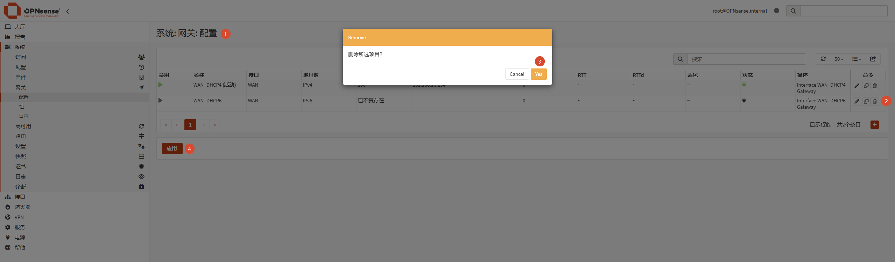

## 仪表盘显示温度传感器

设置为 CPU芯片上温度传感器

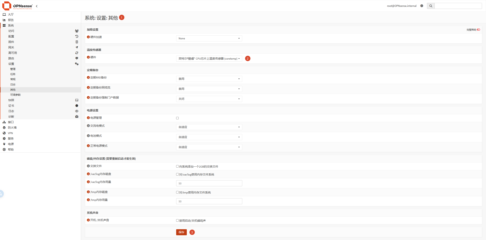

打开仪表盘

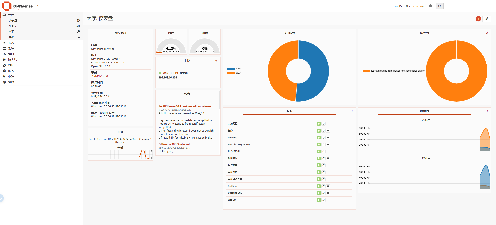

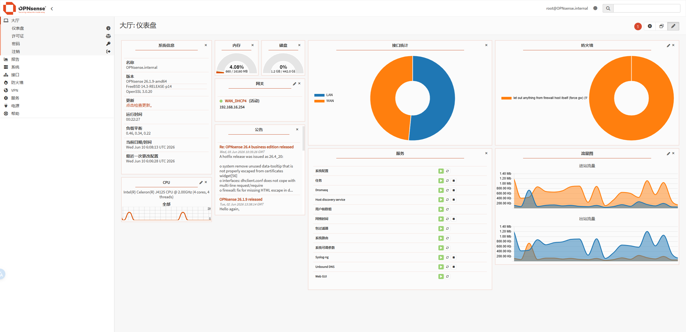

添加温度传感器

点击保存

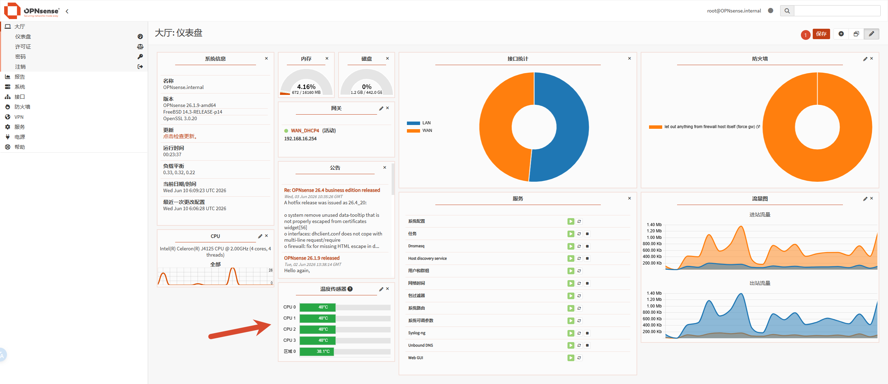

## 仪表盘显示备忘录

打开仪表盘

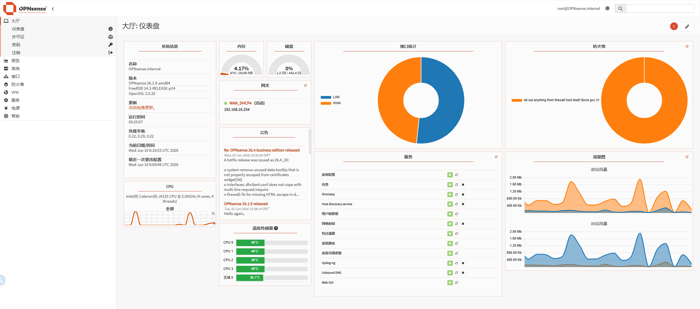

点击添加按钮

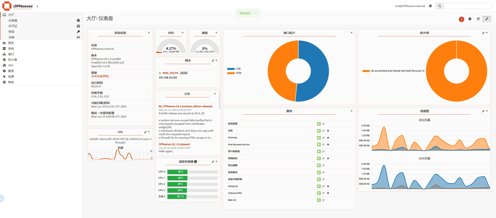

添加 Notes

点击编辑

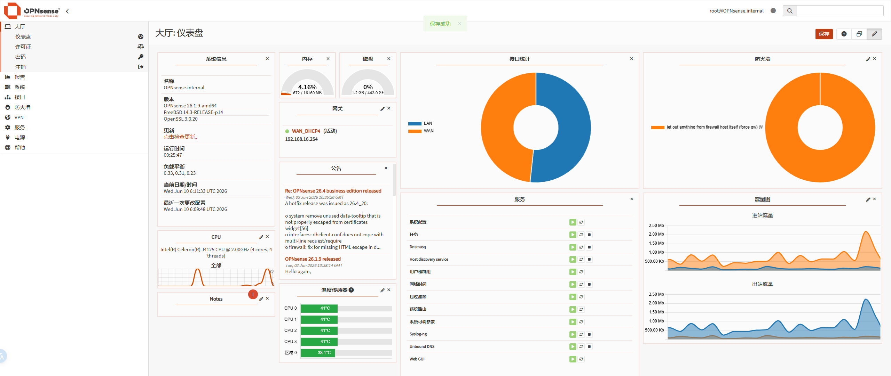

添加内容

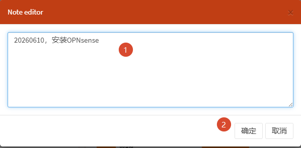

点击保存

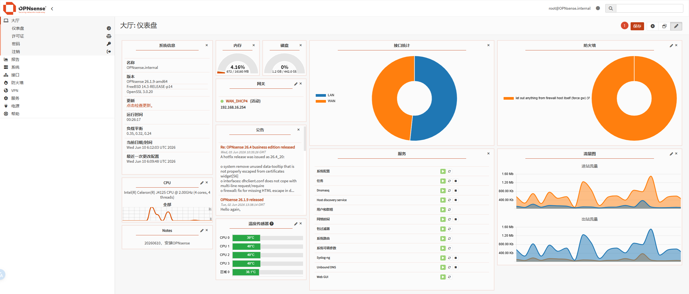

!!! info "参考链接"
    1. [OPNsense 官方文档](https://docs.opnsense.org/hardware/quickstart.html){target=blnak}
    2. [OPNsense使用记录01：安装与基本配置](https://takuron.com/post/id0027/){target=blnak}
    3. [OPNsense 防火墙系列一：安装、基础配置（PPPoE、IPv6、更换软件源）](https://www.cnblogs.com/Yogile/p/16642649.html){target=blnak}
