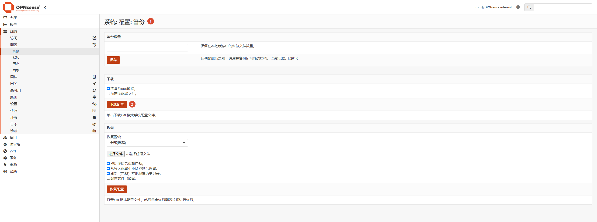
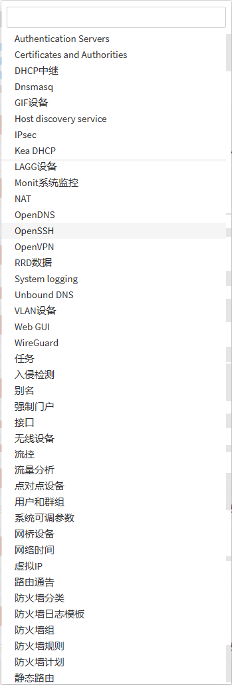
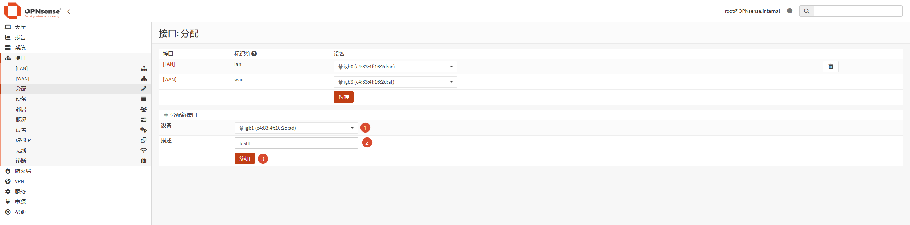
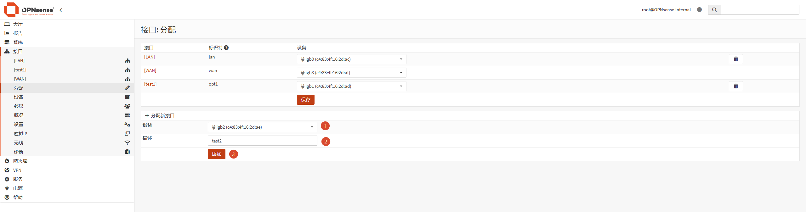
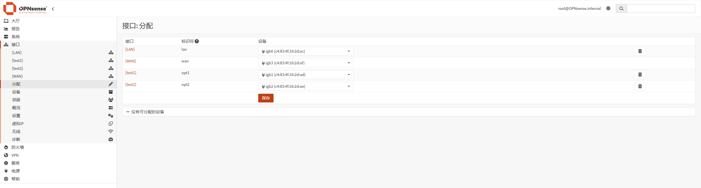
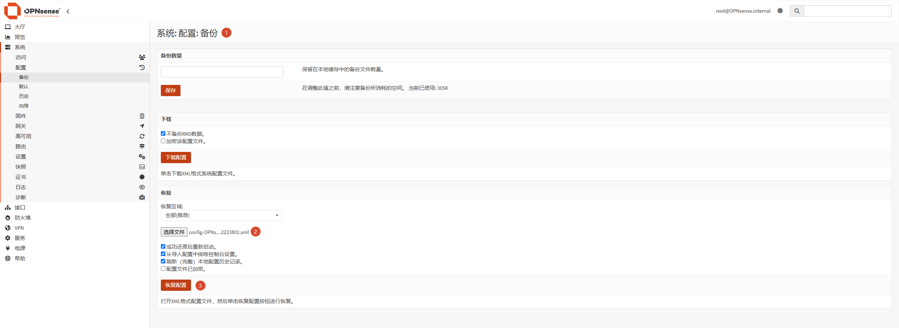
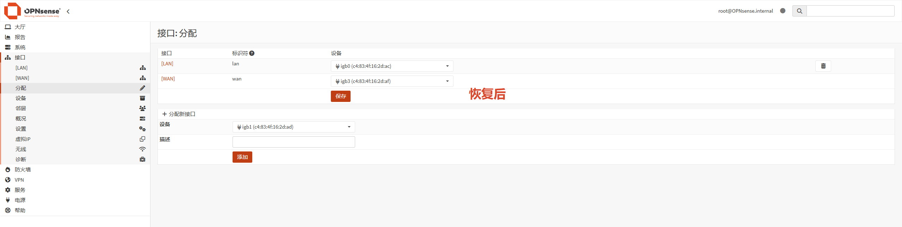

# J4125 - OPNsense 系统配置备份及恢复

## 操作过程

### 访问 http://192.168.1.1 登录管理界面

### 访问 `系统: 配置: 备份`

!!! info "注意"
    - 下载的文件名为 `config-OPNsense.internal-20260622223801.xml`，其中 `20260622223801` 为备份文件下载时间
    - 恢复区域如下图，超出区域内容则丢失配置，比如仪表盘中的 `Notes` 插件

### 【测试恢复】，添加 `test1` 、 `test2` 接口

### 打开下图界面，并选择文件后点击 `恢复配置` 按钮，即可完成恢复

### 查看恢复后的效果，如下图所示

