# J4125 - OPNsense 设置管理口

## 网络环境

> 当前网络环境

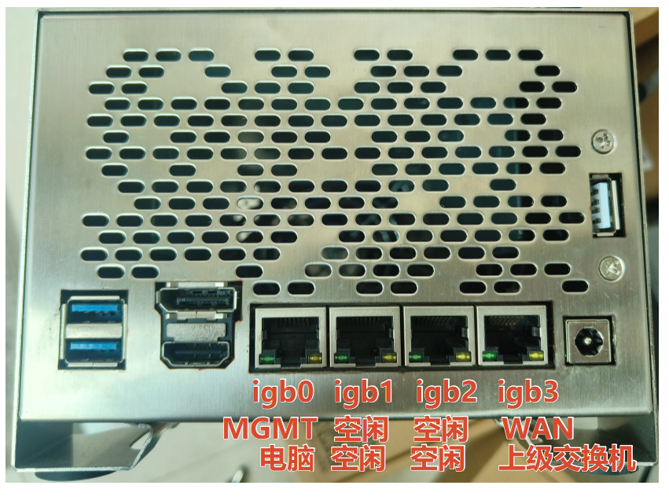

> PC 以 `DHCP` 方式获取 `IP` 地址

## 操作过程

### 访问管理界面

> 访问 http://192.168.1.1 登录管理界面

### 添加网关

> 添加 `192.168.20.254` 网关（可选）

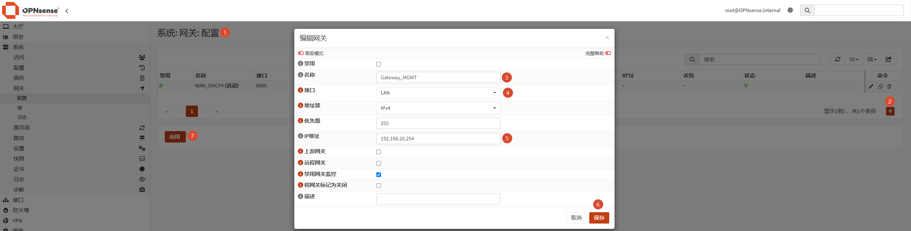

### 修改DHCP

> 进入 `服务: Dnsmasq`

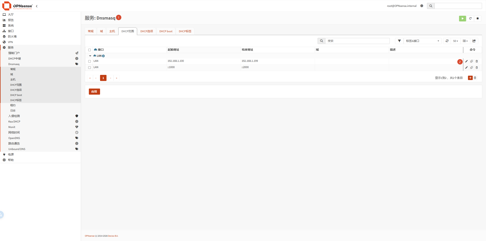

> 修改 `起始地址` 、 `结束地址` 以及 `描述`

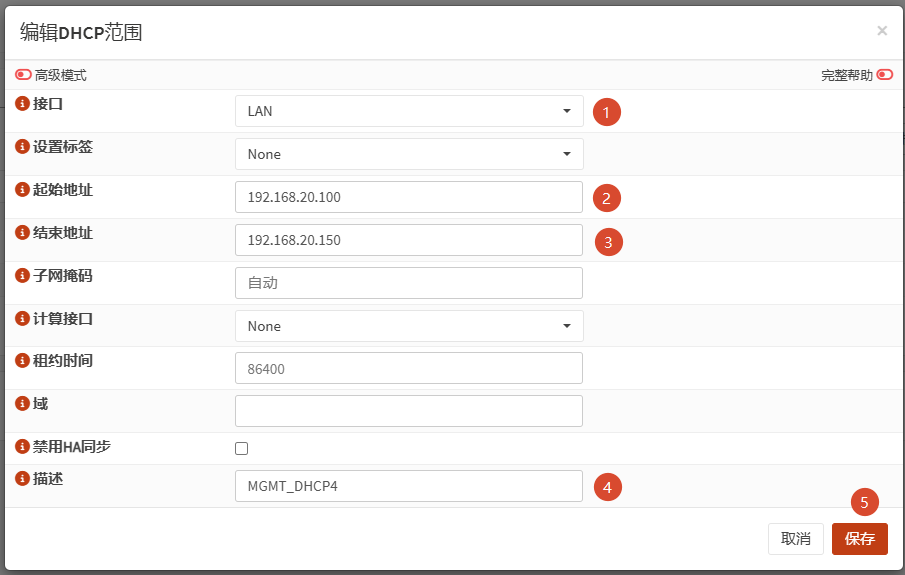

> 删除 IPv6 的 DHCP

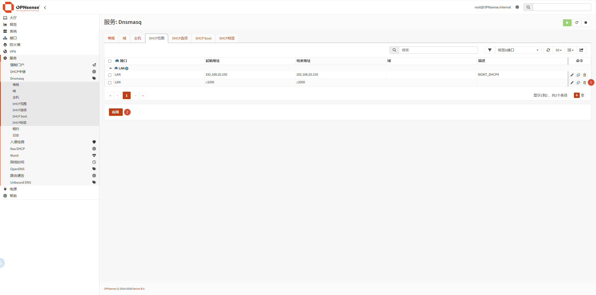

### 修改MGMT

> 修改 MGMT 接口，内容如下图所示

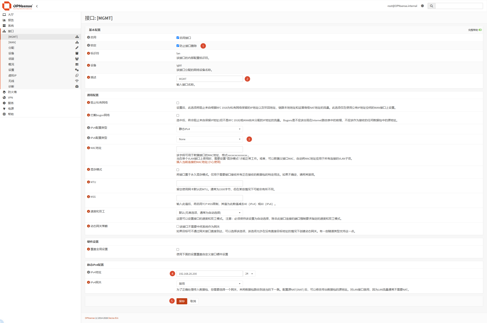

> 重新获取 IP

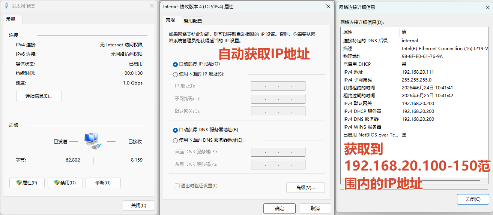

### 修改防火墙

> 在 `防火墙: 规则:Migration assistant` 中导出当前规则文件 `download_rules.csv`

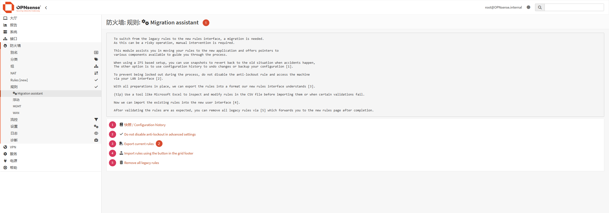

> 在 `防火墙: Rules [new]` 中导入 `download_rules.csv` 规则文件

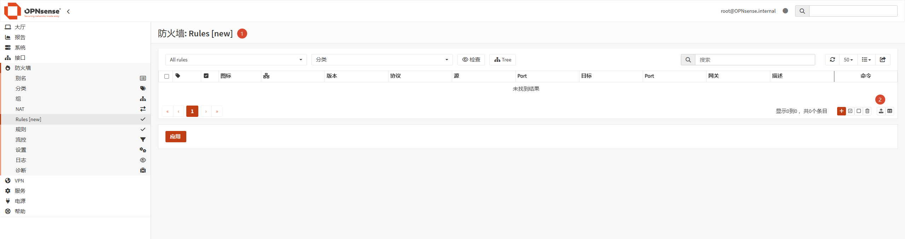

> 选择文件后，点击右侧的按钮，如下图所示

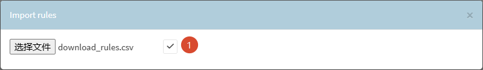

> 查看导入后的规则，如下图所示

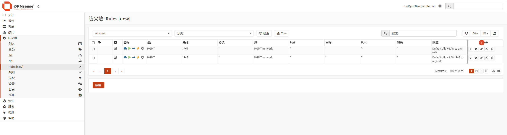

> 在 `防火墙: 规则:Migration assistant` 中清空规则

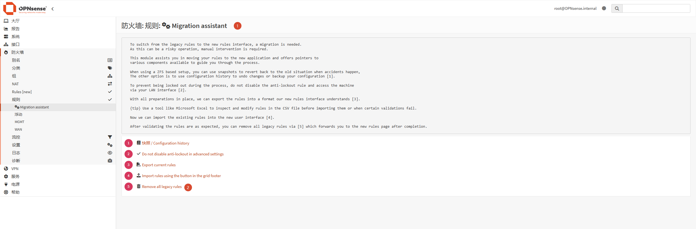

> 在 `防火墙: Rules [new]` 编辑 IPv4 的规则，如下图所示

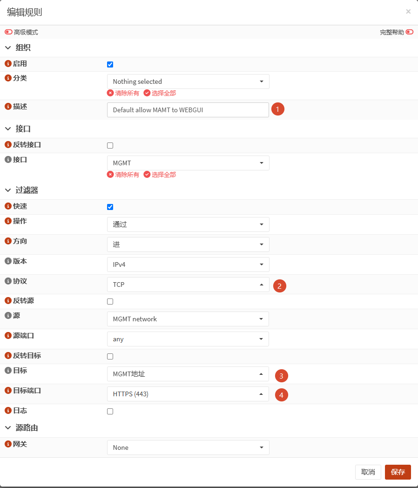

> 在 `防火墙: Rules [new]` 删除 IPv6 的规则，如下图所示

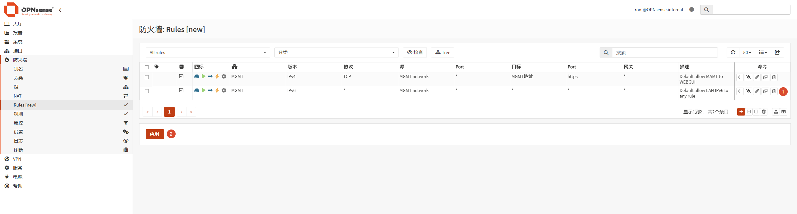

> 检查 OPNsense 的 MGMT 接口是否能正常联网，如下图所示

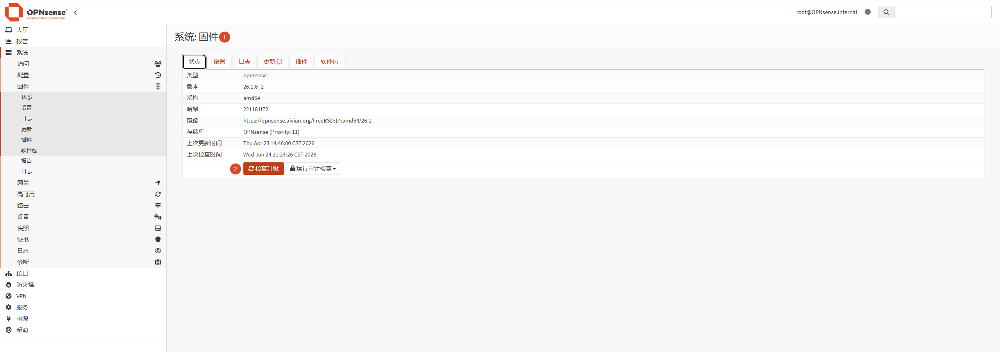

> 正常联网如下图所示

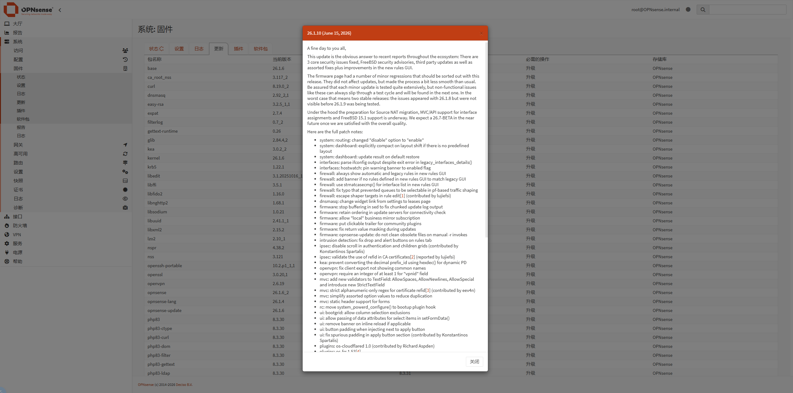

!!! info "参考链接"
    1. [OPNsense Transparent Filtering Bridge (v26.1)](https://www.youtube.com/watch?v=ZCDXNxDhrIQ){target=blank}
