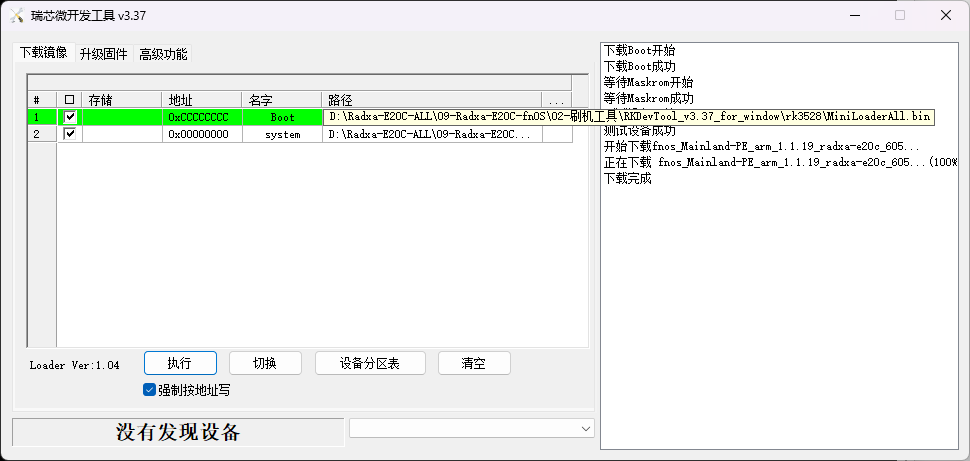
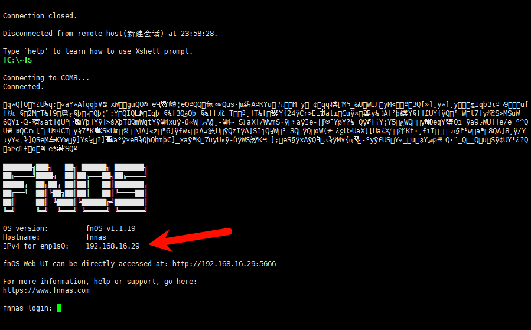
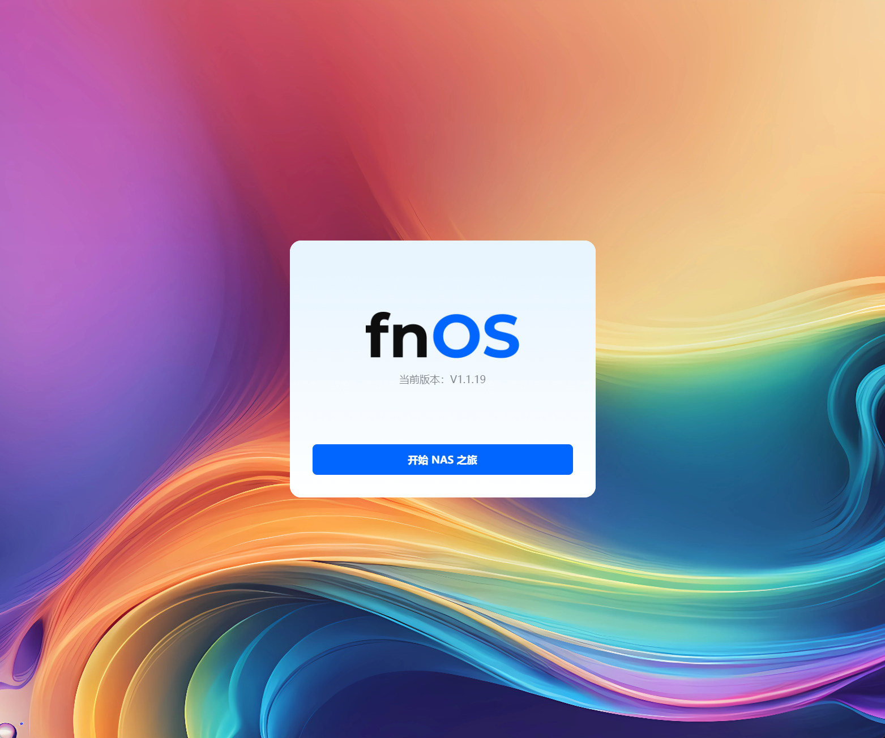

# Radxa E20C 安装 飞牛 fnOS

## 按照官方教程操作

!!! info "参考教程"
    [Rockchip 瑞芯微系列 eMMC USB 线刷教程](https://help.fnnas.com/articles/v1/contact/arm-rk-usb.md){target=blank}

下载官方提供的工具

!!! info
    驱动名称：`DriverAssitant_v5.1.1.zip`

    MD5：`24715FDC945B02EBB373C0A5F566C80B`

    链接：https://static2.fnnas.com/installer/DriverAssitant_v5.1.1.zip

!!! info
    刷机工具名称：`RKDevTool_v3.37_for_window.zip`

    MD5：`87298418574AE62F422BBB12D3158129`

    链接：https://static2.fnnas.com/installer/RKDevTool_v3.37_for_window.zip

!!! info
    名称：`fnos_Mainland-PE_arm_1.1.19_radxa-e20c_605.img.gz`

    MD5：`012d09391a9903792949033b44dfe46d`

    链接：https://iso.liveupdate.fnnas.com/arm/trim/1.1.19/radxa-e20c/fnos_Mainland-PE_arm_1.1.19_radxa-e20c_605.img.gz?sign=329daff4ab40e63734f98c045e410075&t=1774405008

线材连接，需要按以下顺序操作

- 打开 `瑞芯微开发工具`
- 将 `WAN` 连接交换机或者路由器
- 将 `DEBUG` 连接到笔记本，并通过 `设备管理器` 中的 `端口` 获取串口使用的 `COM8` 端口号（注意每个设备有可能不一致，请根据实际调整）
- 长按 `MASKROM`（等设备供电后才可松开）
- 将 `POWER` 连接电源适配器

串口监听

- 打开 `Xsehll` -> `新建`
- `协议` 选择 `SERIAL`
- `连接` -> `SSH` -> `端口号` 选择 `COM8`
- `连接`

刷写固件，配置如下

从 `Xshell` 得到 `飞牛 fnOS` 获取到的IP

访问 `飞牛 fnOS` 管理管理后台，如下

